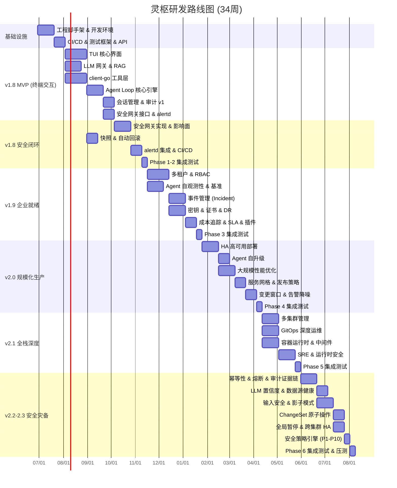
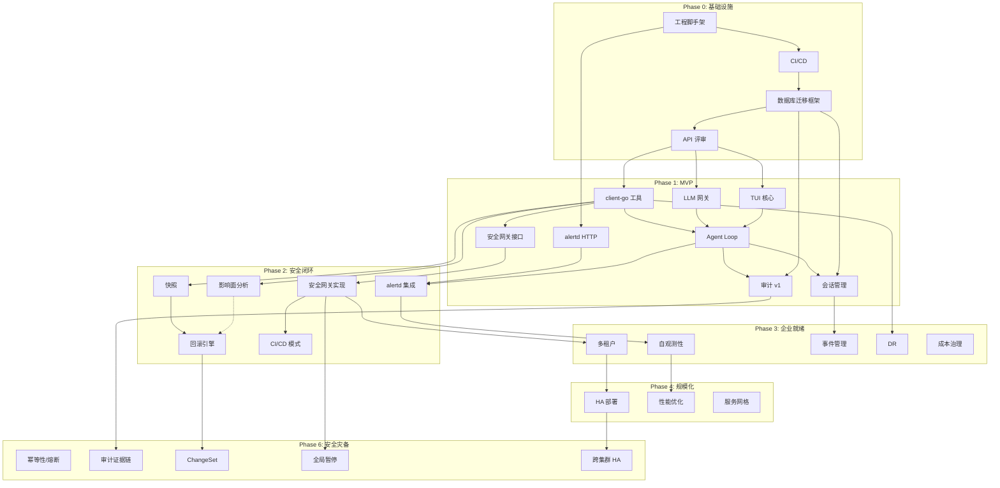

# 灵枢 (LingShu) 研发任务拆解与排期

> **版本**: v2.0 (最终版) | **日期**: 2026-06-26  
> **范围**: PRD v1.8 ~ v2.3 全部 112 个功能章节  
> **目标**: 可直接落地交由开发人员实施  
> **审阅记录**: 初版发现 12 处漏洞，已在本版全部修复

---

## 1. 项目概述

| 项目 | 说明 |
|------|------|
| **产品名称** | 灵枢 (LingShu) / ops-ai-agent |
| **总工期** | 34 周（约 8.5 个月） |
| **里程碑数** | 5 个主里程碑 + 1 个基础设施阶段 |
| **功能覆盖** | PRD §1 ~ §112 |
| **技术栈** | Go 1.22+ / client-go / Bubble Tea / PostgreSQL / Redis / ChromaDB |
| **团队规模** | 12 人 |

---

## 2. 里程碑总览

---

## 3. 详细任务拆解

### Phase 0: 工程基础设施（第 1-5 周）

> **核心目标**：5 分钟内启动完整本地开发环境，API 接口评审通过，数据库迁移框架就绪。

#### 0.1 工程脚手架（第 1-3 周）

| 任务编号 | 任务名称 | 工期 | 负责人 | 前置依赖 | 交付物 | 验收标准 |
|---------|---------|------|--------|---------|--------|---------|
| P0-T01 | Go 项目目录结构初始化 | 3d | 架构组 | 无 | `go.mod` + 标准目录树 | `go build ./...` 无报错；遵循 Go Project Layout |
| P0-T02 | Makefile 构建脚本 | 2d | 架构组 | P0-T01 | Makefile | `make build` / `make test` / `make lint` / `make dev-up` 可用 |
| P0-T03 | 配置管理框架 (Viper) | 3d | 架构组 | P0-T01 | `pkg/config` 模块 | 支持环境变量覆盖 + `config.yaml` 热重载；`schema_version` 字段校验 |
| P0-T04 | 日志框架 (slog) | 2d | 架构组 | P0-T01 | `pkg/logger` 模块 | JSON 格式输出 + trace_id/session_id 上下文注入 |
| P0-T05 | 开发环境 Docker Compose | 3d | 架构组 | P0-T01 | `docker-compose.yaml` | 5 分钟内启动 PG(15) + Redis(7.x哨兵) + MinIO + ChromaDB |
| P0-T06 | Kind 集群模板 + 测试应用 | 3d | 架构组 | P0-T05 | `kind-config.yaml` | 3 节点 kind 集群；预置 nginx / redis 测试应用 |
| P0-T07 | 数据库连接池封装 (sqlx) | 3d | 后端组 | P0-T01 | `pkg/db` 模块 | 支持 PostgreSQL 主写 + SQLite fallback；连接池可配置 |
| P0-T08 | Redis 客户端封装 | 2d | 后端组 | P0-T01 | `pkg/cache` 模块 | 支持哨兵模式 + 连接池 + 分布式锁接口 |
| **P0-T14** | **数据库迁移框架 (golang-migrate)** | **3d** | **后端组** | **P0-T07** | **`migrations/` 目录 + CLI 封装** | **`make migrate-up` / `make migrate-down` 可用；迁移脚本纳入 Code Review** |

> **修复说明 (V04)**：新增 P0-T14。所有数据库 Schema 变更必须通过迁移脚本，禁止手动改表。

#### 0.2 CI/CD & API 设计（第 4-5 周）

| 任务编号 | 任务名称 | 工期 | 负责人 | 前置依赖 | 交付物 | 验收标准 |
|---------|---------|------|--------|---------|--------|---------|
| P0-T09 | GitHub Actions CI 管道 | 3d | DevOps | P0-T01 | `.github/workflows/ci.yaml` | PR 自动触发 lint(golangci-lint) + test + build |
| P0-T10 | 单元测试框架 (testify) | 2d | 后端组 | P0-T01 | `pkg/testutil` 基类 + mock 工具 | 覆盖率基线 60%；支持 mock client-go 接口 |
| P0-T11 | 集成测试框架 (kind) | 3d | 后端组 | P0-T06 | `tests/integration/` | CI 中自动创建 kind 集群并运行测试 |
| P0-T12 | 容器镜像构建 | 2d | DevOps | P0-T09 | `Dockerfile` (distroless/static-debian12) | 镜像大小 < 80MB；nonroot 运行 |
| P0-T13 | Helm Chart 基础模板 | 3d | DevOps | P0-T12 | `charts/ops-ai/` | `helm install ops-ai ./charts/ops-ai` 可部署 |
| **P0-T15** | **API 接口评审与 OpenAPI 生成** | **5d** | **架构组 + 全团队** | **P0-T01** | **`openapi.yaml` + API 评审纪要** | **系统设计文档 §4 所有接口落地为 OpenAPI 3.0；前后端达成一致** |

> **修复说明 (V05)**：新增 P0-T15。API 接口必须在编码前冻结，避免联调返工。

**Phase 0 里程碑验收 (M0)**：
1. 新成员执行 `git clone && make dev-up` 后，5 分钟内环境就绪
2. `make test` 通过，覆盖率 ≥ 60%
3. OpenAPI 文档评审通过，前后端签字确认

---

### Phase 1: v1.8 MVP 终端交互（第 6-16 周）

> **核心目标**：在 Kind 集群中，输入 "排查 nginx Pod 重启原因"，30 秒内输出根因假设。

#### 1.1 TUI 终端界面（第 6-11 周）

> **修复说明 (V01)**：将 TUI 拆分为"核心框架(4周)"和"高级渲染(2周)"，前端组 1 人按 6 周排期。高级渲染(P1-T06/T07)可与 Agent Loop 并行。

| 任务编号 | 任务名称 | 工期 | 负责人 | 前置依赖 | 交付物 | 验收标准 |
|---------|---------|------|--------|---------|--------|---------|
| P1-T01 | Bubble Tea 框架集成 | 5d | 前端组 | P0-T01 | TUI 主循环 + 页面路由 | 无闪烁渲染；支持窗口 resize |
| P1-T02 | 多行输入组件 | 4d | 前端组 | P1-T01 | 带历史记录的输入框 | 支持粘贴多行 YAML；上下键切换历史 |
| P1-T03 | 流式输出渲染 | 5d | 前端组 | P1-T01 | SSE 流式文本渲染 | LLM 逐字输出无卡顿；支持 Markdown 基础格式 |
| P1-T04 | 命令预览与确认面板 | 4d | 前端组 | P1-T01 | 拟执行命令预览 + y/N 确认 | 风险等级高亮（红色=L3/L4，黄色=L2） |
| P1-T05 | 会话状态栏 | 3d | 前端组 | P1-T01 | 底部状态栏 | 显示 cluster/namespace/当前成本/token 用量 |
| P1-T06 | 结果高亮渲染 (YAML/JSON/Table) | 4d | 前端组 | P1-T03 | 结构化输出组件 | 语法高亮 + 折叠展开；大 YAML 不阻塞渲染 |
| P1-T07 | 主题与键盘快捷键 | 3d | 前端组 | P1-T01 | 可配置主题 + 快捷键绑定 | 暗色/亮色/高对比度；vim 风格快捷键可选 |

#### 1.2 LLM 网关 & RAG（第 6-10 周）

| 任务编号 | 任务名称 | 工期 | 负责人 | 前置依赖 | 交付物 | 验收标准 |
|---------|---------|------|--------|---------|--------|---------|
| P1-T08 | OpenAI 适配器 | 4d | AI组 | P0-T01 | HTTP + SSE 客户端 | GPT-4o 流式输出；支持 function_call |
| P1-T09 | Claude 适配器 | 3d | AI组 | P1-T08 | Claude API 客户端 | Claude-3-opus 流式输出；工具调用格式统一 |
| P1-T10 | Ollama 本地模型适配器 | 4d | AI组 | P1-T08 | 本地模型 fallback | qwen2.5-coder:7b 可用；自动检测本地服务 |
| P1-T11 | LLM 路由与故障切换 | 3d | AI组 | P1-T08 P1-T09 | 多供应商路由 | 主供应商失败 3s 内切换备用；降级到本地模型 |
| P1-T12 | Prompt 模板引擎 | 5d | AI组 | P1-T08 | 结构化 Prompt 模板 | 支持变量注入 + 版本管理 + A/B 测试 |
| P1-T13 | Token 用量追踪中间件 | 3d | AI组 | P1-T08 | `pkg/llm/metrics.go` | 每次调用记录 input/output tokens；写入 usage_records |
| P1-T14 | ChromaDB 集成 | 4d | AI组 | P0-T05 | `pkg/rag` 模块 | 向量存储 + 相似度检索接口 |
| P1-T15 | 基础 RAG 检索 | 5d | AI组 | P1-T14 | Runbook 语义搜索 | Top-5 召回率 > 80%；支持中文语义匹配 |

#### 1.3 client-go 工具层（第 6-11 周）

| 任务编号 | 任务名称 | 工期 | 负责人 | 前置依赖 | 交付物 | 验收标准 |
|---------|---------|------|--------|---------|--------|---------|
| P1-T16 | client-go 连接管理 | 5d | K8s组 | P0-T01 | `pkg/k8s/client.go` | 多集群 kubeconfig 管理；上下文热切换 |
| P1-T17 | L0 工具集 (get/describe/logs/events) | 7d | K8s组 | P1-T16 | `pkg/tools/l0/` | 覆盖 Pod/Deployment/Service/Event/Ingress/ConfigMap |
| P1-T18 | L1 工具集 (top/status/nodes) | 4d | K8s组 | P1-T17 | `pkg/tools/l1/` | 资源使用状态 + 节点健康 |
| P1-T19 | L2 工具集 (scale/restart/patch/rollout) | 7d | K8s组 | P1-T17 | `pkg/tools/l2/` | HPA 扩容 / Deployment 重启 / 镜像更新 |
| P1-T20 | 工具结果格式化器 | 4d | K8s组 | P1-T17 | `pkg/tools/formatter.go` | YAML/JSON/表格统一输出；LLM 友好格式 |
| P1-T21 | API Server 限流与重试 | 3d | K8s组 | P1-T16 | `pkg/k8s/ratelimiter.go` | 默认 QPS=20, Burst=50；指数退避重试 |

#### 1.4 Agent Loop 核心引擎（第 12-16 周）

| 任务编号 | 任务名称 | 工期 | 负责人 | 前置依赖 | 交付物 | 验收标准 |
|---------|---------|------|--------|---------|--------|---------|
| P1-T22 | 核心推理循环框架 | 7d | AI组 | P1-T08 P1-T17 | `pkg/agent/loop.go` | 支持 思考→工具调用→结果注入→再思考 循环 |
| P1-T23 | function_call 解析器 | 4d | AI组 | P1-T22 | `pkg/agent/parser.go` | 准确提取工具名和参数；错误时友好提示 |
| P1-T24 | 上下文窗口管理 | 5d | AI组 | P1-T22 | `pkg/agent/context.go` | Token 预算控制；超限自动裁剪历史；保留关键上下文 |
| P1-T25 | 并行工具调用 | 5d | AI组 | P1-T22 | `pkg/agent/parallel.go` | 多工具并发执行；独立超时；结果聚合 |
| P1-T26 | 全局超时 & 死循环检测 | 4d | AI组 | P1-T22 | `pkg/agent/timeout.go` | 5分钟全局超时；循环超过 10 轮自动终止 |
| **P1-T29** | **安全网关接口定义 (L0-L4)** | **3d** | **安全组 + 架构组** | **P1-T19 P1-T22** | **`pkg/security/gateway.go` 接口** | **Agent Loop 可调用；预留风险等级扩展点** |

> **修复说明 (V10)**：新增 P1-T29。安全网关接口必须在 Agent Loop 实现时定义，避免后期重构。

#### 1.5 会话管理、审计、alertd（第 14-16 周）

| 任务编号 | 任务名称 | 工期 | 负责人 | 前置依赖 | 交付物 | 验收标准 |
|---------|---------|------|--------|---------|--------|---------|
| P1-T27 | 会话管理 (创建/恢复/过期) | 5d | 后端组 | P0-T07 P0-T14 | `pkg/session/` + `sessions` 表 | SQLite 存储 + 24h 过期；`parent_session_id` 追溯链 |
| **P1-T28** | **审计日志 v1 (PostgreSQL + 文件降级)** | **5d** | **后端组** | **P0-T07 P0-T14 P1-T22** | **`audit_events` 表 + 异步写入** | **异步批量写入不阻塞 Loop；PG 故障降级到文件** |
| **P1-T30** | **alertd HTTP Webhook 服务端** | **4d** | **后端组** | **P0-T01** | **`cmd/alertd/` HTTP 服务** | **接收 AlertManager/PagerDuty Webhook；独立进程可运行** |

> **修复说明 (V03)**：P1-T28 从"文件/stdout"改为"PostgreSQL 为主 + 文件降级"，与系统设计文档一致。  
> **修复说明 (V07)**：新增 P1-T30。alertd HTTP 服务端独立开发，不阻塞于 Agent Loop 完整实现。

**Phase 1 里程碑验收 (M1)**：
1. 在 Kind 集群输入 "排查 nginx Pod 重启原因"，30 秒内输出根因假设
2. LLM function_call 准确率 ≥ 85%（人工评测 50 条样本）
3. 工具调用延迟 < 3s（P95）

---

### Phase 2: v1.8 安全闭环（第 17-23 周）

> **核心目标**：在生产 namespace 执行 `ops-ai scale nginx 5`，系统完成：影响面分析 → 快照 → 确认 → 执行 → 回滚可用。

#### 2.1 安全网关实现（第 17-19 周）

> **修复说明 (V02)**：将 RBAC 预检(P2-T05)转移给 K8s 组，环境上下文权重(P2-T02)转移给后端组，安全组 1 人 3 周产能 15 天，现任务总量 12 天，可行。

| 任务编号 | 任务名称 | 工期 | 负责人 | 前置依赖 | 交付物 | 验收标准 |
|---------|---------|------|--------|---------|--------|---------|
| P2-T01 | 风险等级判定引擎实现 | 5d | 安全组 | P1-T29 P1-T19 | `pkg/security/evaluator.go` | 正确分类 get(L0)/scale(L2)/delete(L3) 风险 |
| P2-T02 | 环境上下文权重 | 3d | 后端组 | P2-T01 | namespace 环境识别 | production 权重 +2；kube-system 权重 +3 |
| P2-T03 | 操作确认流程 (TUI 弹窗) | 4d | 安全组 | P2-T01 P1-T04 | L2/L3/L4 确认弹窗 | 用户输入 y/N 后才执行；支持 `--yes` 跳过 L1-L2 |
| P2-T04 | 生产环境铁律拦截 | 3d | 安全组 | P2-T01 | ClusterRoleBinding 禁止 | L3+ 操作禁止集群级绑定；namespace 级 RoleBinding 检查 |
| P2-T05 | RBAC 权限预检 | 3d | K8s组 | P1-T16 | SelfSubjectAccessReview | 无权限提前拒绝；权限不足时给出建议 |

#### 2.2 影响面分析 & 快照（第 17-20 周）

> **修复说明 (V06)**：P2-T08 快照前置依赖从 P2-T06 改为 P1-T17，与影响面分析并行开发。

| 任务编号 | 任务名称 | 工期 | 负责人 | 前置依赖 | 交付物 | 验收标准 |
|---------|---------|------|--------|---------|--------|---------|
| P2-T06 | 资源依赖图构建 | 5d | K8s组 | P1-T17 | `pkg/impact/graph.go` | ConfigMap→Deployment→Service→Ingress；深度 3 层 |
| P2-T07 | 影响面分析展示 | 4d | K8s组 | P2-T06 P1-T06 | TUI 拓扑图渲染 | 受影响资源高亮显示；可直接跳转详情 |
| P2-T08 | 变更前快照 | 5d | K8s组 | **P1-T17** | `pkg/snapshot/` + `snapshots` 表 | 完整保存原始 YAML；支持按资源类型过滤 |
| P2-T09 | Secret 快照 AES-256-GCM 加密 | 3d | 安全组 | P2-T08 | 加密存储模块 | 加密后存储；解密后恢复；密钥由 K8s Secret 管理 |
| P2-T10 | 回滚引擎 | 6d | K8s组 | P2-T08 | `pkg/rollback/` | Deployment rollout undo / ConfigMap restore / 手动 YAML apply |

#### 2.3 alertd 集成 & CI/CD 模式（第 20-23 周）

| 任务编号 | 任务名称 | 工期 | 负责人 | 前置依赖 | 交付物 | 验收标准 |
|---------|---------|------|--------|---------|--------|---------|
| P2-T11 | alertd 与 Agent Loop 集成 | 4d | AI组 | P1-T30 P1-T22 | 告警触发自动诊断 | 收到告警 30s 内输出报告；支持告警聚类 |
| P2-T12 | 告警通知回写 | 3d | 后端组 | P2-T11 | AlertManager note / Slack 通知 | 诊断结果写入告警注释；P0 告警 IM 通知 |
| P2-T13 | `--no-tui --yes` 无交互模式 | 4d | 前端组 | P1-T01 | CLI 无交互模式 | 自动确认 L1-L2；L3+ 仍须显式确认 |
| P2-T14 | `--pipe` 管道模式 | 3d | 前端组 | P1-T01 | 纯文本 JSON/YAML 输出 | 支持 `| jq` / `| yq` 处理；退出码语义化 |
| P2-T15 | 语义化退出码 | 2d | 前端组 | P2-T13 | 0-4 退出码定义 | 0=成功, 1=错误, 2=需确认, 3=拒绝, 4=崩溃 |

#### 2.4 Phase 1-2 集成测试（第 22-23 周）

> **修复说明 (V09)**：新增集成测试任务，覆盖端到端场景。

| 任务编号 | 任务名称 | 工期 | 负责人 | 前置依赖 | 交付物 | 验收标准 |
|---------|---------|------|--------|---------|--------|---------|
| **P2-T16** | **端到端场景测试 (kind)** | **5d** | **测试组** | **P1-T22 P2-T10 P2-T03** | **`tests/e2e/` 测试套件** | **覆盖：诊断→影响面→快照→确认→执行→回滚完整流程** |
| **P2-T17** | **安全网关误判率基准测试** | **3d** | **测试组 + 安全组** | **P2-T01** | **50 条样本人工标注集** | **误判率 < 10%；建立持续优化数据集** |

> **修复说明 (V03)**：新增 P2-T17。安全网关误判是核心风险，需建立可量化的基准。

**Phase 2 里程碑验收 (M2)**：
1. 在 Kind 集群执行 `ops-ai scale deployment/nginx --replicas 5`，完整走通：影响面分析 → 快照 → 确认 → 执行 → 回滚验证
2. alertd 接收模拟告警后 30s 内输出诊断报告
3. `--no-tui --yes` 模式下 CI 管道可用，退出码正确

---

### Phase 3: v1.9 企业就绪（第 24-33 周）

> **核心目标**：企业客户可在生产环境部署，支持 3 个团队隔离使用，审计日志完整，月度成本可控。

#### 3.1 多租户 & RBAC（第 24-27 周）

| 任务编号 | 任务名称 | 工期 | 负责人 | 前置依赖 | 交付物 | 验收标准 |
|---------|---------|------|--------|---------|--------|---------|
| P3-T01 | OIDC/SAML 认证 | 7d | 安全组 | P0-T07 | `pkg/auth/` JWT 验证 | 支持 Keycloak/Okta/企业 AD；Token 刷新机制 |
| P3-T02 | 用户 & 团队数据模型 | 4d | 后端组 | P0-T14 | users/teams/memberships/namespace_acls 表 | 多对多关系；RLS 策略就绪 |
| P3-T03 | Namespace ACL 引擎 | 5d | K8s组 | P3-T02 | 白名单/黑名单匹配 | team-A 只能访问指定 namespace；deny 优先 |
| P3-T04 | 审计日志多租户隔离 | 3d | 后端组 | P3-T02 P1-T28 | 团队级审计视图 | admin 可见全部；viewer 仅本团队 |
| P3-T05 | 配置继承体系 | 4d | 后端组 | P3-T02 | 全局→团队→用户配置覆盖 | 优先级正确；热重载不影响运行中会话 |
| P3-T06 | 会话可见性三级控制 | 3d | 后端组 | P3-T02 | 公开/团队/私有 | 非授权用户无法查看；URL 分享权限校验 |

#### 3.2 Agent 自观测性 & 性能基准（第 24-28 周）

| 任务编号 | 任务名称 | 工期 | 负责人 | 前置依赖 | 交付物 | 验收标准 |
|---------|---------|------|--------|---------|--------|---------|
| P3-T07 | Prometheus `/metrics` 端点 | 5d | 后端组 | P0-T01 | `pkg/metrics/` | 暴露 15+ 核心指标（会话数/LLM延迟/工具成功率/成本） |
| P3-T08 | LLM 调用指标细分 | 3d | AI组 | P3-T07 | 按模型/操作聚合 | latency P50/P95/P99；token 用量；成本 USD |
| P3-T09 | 健康检查端点 `/health` | 3d | 后端组 | P3-T07 | 依赖健康探测 | 检查 PG/Redis/K8s/LLM；任一失败返回 degraded |
| P3-T10 | 审计写入失败降级 | 4d | 后端组 | P1-T28 | 内存 ring buffer | PG 故障时降级到文件；恢复后自动补写 |
| P3-T11 | 崩溃恢复 & 增量 checkpoint | 5d | 后端组 | P1-T27 | 会话状态自动保存 | 崩溃后恢复活跃会话；checkpoint 每 30s |
| **P3-T25** | **性能基准测试建立** | **4d** | **测试组** | **P3-T07** | **基准测试报告** | **100节点集群：诊断延迟 P95 < 5s；内存 < 500MB** |

> **修复说明 (V11)**：新增 P3-T25。Phase 4 性能优化必须有基准数据支撑。

#### 3.3 事件管理与 DR（第 27-31 周）

| 任务编号 | 任务名称 | 工期 | 负责人 | 前置依赖 | 交付物 | 验收标准 |
|---------|---------|------|--------|---------|--------|---------|
| P3-T12 | Incident 数据模型 | 3d | 后端组 | P0-T14 | incidents/timeline_events 表 | P0-P4 分级；关联 session_id |
| P3-T13 | War Room 自动创建 | 5d | 后端组 | P3-T12 | Slack/飞书 API 集成 | P0 事件 10s 内创建频道；@相关人 |
| P3-T14 | 时间线自动生成 | 4d | AI组 | P3-T12 P1-T28 | 从审计日志提取 | 按时间顺序排列；自动分类 alert/diagnosis/action |
| P3-T15 | Postmortem 草稿生成 | 5d | AI组 | P3-T14 | LLM 生成事故报告 | 包含时间线/根因/改进项；人工可编辑 |
| P3-T16 | 证书过期巡检 | 4d | K8s组 | P1-T16 | TLS/Secret 证书扫描 | 30/60/90 天过期预警；支持 ESO 集成 |
| P3-T17 | etcd 诊断降级模式 | 5d | K8s组 | P1-T16 | API Server 不可达时 SSH 诊断 | 云厂商 API + SSH 兜底；无需 K8s API |
| P3-T18 | Velero & CSI Snapshot 集成 | 5d | K8s组 | P3-T17 | 备份恢复辅助 | 识别 Velero Backup/Restore；Snapshot 资源状态 |

#### 3.4 成本治理与插件（第 29-33 周）

| 任务编号 | 任务名称 | 工期 | 负责人 | 前置依赖 | 交付物 | 验收标准 |
|---------|---------|------|--------|---------|--------|---------|
| P3-T19 | 单会话成本追踪 | 4d | 后端组 | P1-T13 P0-T14 | usage_records 表 | 精确到每次 LLM 调用；实时累计 |
| P3-T20 | 月度预算告警与限流 | 3d | 后端组 | P3-T19 | 50%/75%/90%/100% 阈值 | 超额自动限流；P0 告警不计入预算 |
| P3-T21 | SLA 护栏 (Token/成本上限) | 4d | 后端组 | P3-T19 | 单会话硬限制 | 默认 100K tokens / $5；可配置 |
| P3-T22 | 插件接口定义与注册 | 5d | 架构组 | P0-T01 | `pkg/plugin/interface.go` | 热加载/卸载；版本兼容性检查 |
| P3-T23 | 自定义工具注入沙箱 | 4d | 架构组 | P3-T22 | seccomp + 资源限制 | 限制系统调用；超时 30s；内存限制 128MB |

#### 3.5 Phase 3 集成测试（第 32-33 周）

| 任务编号 | 任务名称 | 工期 | 负责人 | 前置依赖 | 交付物 | 验收标准 |
|---------|---------|------|--------|---------|--------|---------|
| **P3-T24** | **多租户端到端测试** | **4d** | **测试组** | **P3-T01 P3-T03 P3-T04** | **3 团队隔离测试** | **team-A 无法查看 team-B 会话/审计；namespace ACL 生效** |
| **P3-T25** | **成本治理压力测试** | **3d** | **测试组** | **P3-T21** | **100 并发会话** | **预算超限后自动限流；系统不崩溃** |

**Phase 3 里程碑验收 (M3)**：
1. 3 个团队同时在线使用，数据完全隔离
2. 月度成本报表准确，预算超限自动限流
3. 模拟 Agent 崩溃后，活跃会话 30s 内恢复

---

### Phase 4: v2.0 规模化生产（第 34-42 周）

> **核心目标**：500 节点集群稳定运行，Agent 自身可用性 99.9%，升级零停机。

#### 4.1 高可用与自升级（第 34-37 周）

| 任务编号 | 任务名称 | 工期 | 负责人 | 前置依赖 | 交付物 | 验收标准 |
|---------|---------|------|--------|---------|--------|---------|
| P4-T01 | StatefulSet 多副本 Helm Chart | 5d | DevOps | P0-T13 | 3 副本 + RWX PVC | 有序部署；Pod-0 优先启动 |
| P4-T02 | K8s Lease Leader Election | 5d | K8s组 | P4-T01 | `pkg/ha/leader.go` | coordination/v1 集成；Leader 故障 15s 内切换 |
| P4-T03 | 会话共享存储 (PVC/S3) | 4d | K8s组 | P4-T01 | RWX PVC + S3 双写 | 多 Pod 同时读取；S3 作为冷备 |
| P4-T04 | 会话故障转移 | 5d | 后端组 | P4-T02 P4-T03 | 活跃会话恢复 | 切换后会话上下文不丢失；Follower 接管 Leader |
| P4-T05 | 版本兼容性检查 | 4d | 后端组 | P4-T01 | 升级前预检 | API/配置/Schema 兼容性；破坏性变更 block/warn/allow |
| P4-T06 | 滚动升级 & 自动回滚 | 5d | DevOps | P4-T05 | Helm upgrade --rollback | 升级失败自动回滚；会话热迁移 |
| P4-T07 | 会话热迁移 | 4d | 后端组 | P4-T04 | 升级前会话持久化 | 升级后恢复完整上下文；RTO < 30s |

#### 4.2 大规模性能优化（第 35-38 周）

| 任务编号 | 任务名称 | 工期 | 负责人 | 前置依赖 | 交付物 | 验收标准 |
|---------|---------|------|--------|---------|--------|---------|
| P4-T08 | 扫描结果缓存 (Redis TTL) | 4d | K8s组 | P1-T17 P0-T08 | TTL 5min 缓存 | 命中时减少 API Server 调用 80% |
| P4-T09 | 增量扫描 (resourceVersion) | 5d | K8s组 | P1-T16 | informer ListWatch | 只拉取变更资源；500 节点集群可用 |
| P4-T10 | 分页列表与流式输出 | 3d | K8s组 | P1-T17 | 默认 200/最大 500 | 大列表不 OOM；流式输出不阻塞 |
| P4-T11 | 审计批量写入 | 4d | 后端组 | P1-T28 | 每批 100 条 / 5s flush | 高并发不阻塞 Loop；PG 写入延迟 < 100ms |
| P4-T12 | 轻量级模式自动降级 | 3d | 后端组 | P4-T08 | 资源检测 + 功能降级 | CPU<4核或内存<8GB 时禁用 RAG/合规扫描 |

#### 4.3 服务网格、发布策略、变更管控（第 37-42 周）

| 任务编号 | 任务名称 | 工期 | 负责人 | 前置依赖 | 交付物 | 验收标准 |
|---------|---------|------|--------|---------|--------|---------|
| P4-T13 | Istio/Linkerd 自动探测 | 5d | K8s组 | P1-T16 | 控制平面健康检查 | 识别 Envoy/Sidecar 状态；VirtualService 冲突检测 |
| P4-T14 | Argo Rollouts 发布辅助 | 5d | K8s组 | P1-T16 | 金丝雀/蓝绿发布 | 流量渐进切换；自动健康检查基线对比 |
| P4-T15 | 变更窗口与维护模式 | 4d | 后端组 | P2-T01 | 时间段规则引擎 | 非窗口期拦截 L2+ 操作；一键冻结仅允许 L0 |
| P4-T16 | on-call 日历集成 | 4d | 后端组 | P4-T15 | PagerDuty/OpsGenie | L3+ 操作需 on-call 在场；紧急变更双人确认 |
| P4-T17 | 告警降噪 (聚类/去重/静默) | 5d | AI组 | P1-T30 P2-T11 | 相似度算法 | 同一根因只生成 1 个修复会话；成本保护 $10/风暴 |
| P4-T18 | K3s 边缘支持 | 4d | K8s组 | P1-T16 | 轻量级模式 + ARM | 资源受限自动降级；不稳定网络指数退避 |

#### 4.4 Phase 4 集成测试（第 41-42 周）

| 任务编号 | 任务名称 | 工期 | 负责人 | 前置依赖 | 交付物 | 验收标准 |
|---------|---------|------|--------|---------|--------|---------|
| **P4-T19** | **500 节点集群压测** | **5d** | **测试组** | **P4-T08 P4-T09** | **压测报告** | **API Server QPS 不超限；内存 < 2GB；诊断 P95 < 10s** |
| **P4-T20** | **故障注入测试 (Chaos Mesh)** | **4d** | **测试组** | **P4-T02 P4-T04** | **HA 测试报告** | **Leader Pod 删除后 15s 内恢复；会话不丢失** |

**Phase 4 里程碑验收 (M4)**：
1. 500 节点集群压测通过，Agent 自身可用性 99.9%
2. Leader Pod 删除后 15s 内故障转移完成
3. Helm upgrade 零停机，失败自动回滚

---

### Phase 5: v2.1 全栈深度（第 43-51 周）

| 任务编号 | 任务名称 | 工期 | 负责人 | 前置依赖 | 交付物 | 验收标准 |
|---------|---------|------|--------|---------|--------|---------|
| P5-T01 | 多集群 kubeconfig 统一管理 | 7d | K8s组 | P1-T16 | 跨集群上下文切换 | 支持 10+ 集群；快速切换 |
| P5-T02 | 跨集群资源差异检测 | 5d | K8s组 | P5-T01 | 镜像/配置/env 对比 | 差异高亮；支持一键同步 |
| P5-T03 | ArgoCD Application 深度诊断 | 7d | K8s组 | P1-T17 | Sync/Health/OutOfSync 分析 | 识别缺失资源；自动比对 Git 目标状态 |
| P5-T04 | Flux Kustomization 诊断 | 5d | K8s组 | P1-T17 | HelmRelease/Kustomization 状态 | 渲染错误定位；依赖冲突检测 |
| P5-T05 | containerd/CRI-O 运行时诊断 | 5d | K8s组 | P1-T17 | 运行时状态检查 | ImagePullBackOff 根因分析；sandbox 错误诊断 |
| P5-T06 | OpenTelemetry/Jaeger 链路追踪 | 6d | 后端组 | P3-T07 | 分布式追踪集成 | Agent Loop 全链路追踪；P0 告警 100% 采样 |
| P5-T07 | Falco 运行时安全分析 | 5d | 安全组 | P1-T30 | 安全事件响应 | seccomp/AppArmor 审计；异常行为检测 |
| P5-T08 | Redis/Kafka/ES 深度诊断 | 5d | K8s组 | P1-T17 | 中间件运维工具 | Redis 大 Key/慢查询；Kafka Lag/ISR；ES 索引/磁盘 |
| P5-T09 | SLO 定义与错误预算 | 6d | 后端组 | P3-T07 | SLI/SLO/ErrorBudget 表 | PromQL 自动计算；发布门禁（预算耗尽禁止发布） |
| P5-T10 | AWS/Azure/GCP/阿里云集成 | 7d | K8s组 | P1-T16 | 云厂商诊断工具 | RDS/ALB/S3/云监控状态查询 |

#### Phase 5 集成测试（第 50-51 周）

| 任务编号 | 任务名称 | 工期 | 负责人 | 前置依赖 | 交付物 | 验收标准 |
|---------|---------|------|--------|---------|--------|---------|
| **P5-T11** | **5 集群统一运维 E2E 测试** | **5d** | **测试组** | **P5-T01 P5-T03** | **多集群测试套件** | **跨集群诊断正常；GitOps 冲突检测生效** |
| **P5-T12** | **中间件诊断准确率测试** | **4d** | **测试组** | **P5-T08** | **诊断准确率报告** | **Redis/Kafka 常见故障诊断准确率 > 85%** |

**Phase 5 里程碑验收 (M5)**：
1. 5 个集群统一管理，切换延迟 < 1s
2. ArgoCD Application OutOfSync 根因定位准确率 > 80%
3. SLO 错误预算耗尽时自动拦截发布

---

### Phase 6: v2.2-2.3 安全灾备（第 52-60 周）

> **核心目标**：通过 7 维度压力测试（安全/可靠/可观测/可维护/性能/成本/合规）。

#### 6.1 工程可靠性（第 52-55 周）

| 任务编号 | 任务名称 | 工期 | 负责人 | 前置依赖 | 交付物 | 验收标准 |
|---------|---------|------|--------|---------|--------|---------|
| P6-T01 | 修复幂等性 (30min 去重窗口) | 5d | 后端组 | P1-T30 | `pkg/idempotency/` | 同一告警 30min 内只执行一次；状态预检 |
| P6-T02 | 熔断器 (3次失败/1h冷却) | 5d | 后端组 | P6-T01 | `pkg/circuitbreaker/` | OPEN 状态拒绝修复；HALF_OPEN 试探恢复 |
| P6-T03 | 效果验证 (10min窗口) | 4d | AI组 | P6-T02 | 修复后指标验证 | 告警恢复确认；指标回归基线对比 |
| P6-T04 | 审计证据链 (SHA-256 哈希链) | 6d | 安全组 | P1-T28 | 哈希链 + WORM 存储 | 链式完整性可验证；防篡改 |
| P6-T05 | 数据源健康探针 | 4d | 后端组 | P3-T07 | Prometheus/Loki/APIServer 探针 | 数据不可靠时降级；质量评分 0-1 |

#### 6.2 LLM 安全与信任（第 52-56 周）

| 任务编号 | 任务名称 | 工期 | 负责人 | 前置依赖 | 交付物 | 验收标准 |
|---------|---------|------|--------|---------|--------|---------|
| P6-T06 | LLM 置信度评估 | 5d | AI组 | P1-T22 | 多模型投票 + 知识库校验 | 置信度 0-1；< 0.7 降级为建议模式 |
| P6-T07 | 幻觉检测 | 4d | AI组 | P6-T06 | 虚构资源/过时 API 检测 | 幻觉率 < 5% |
| P6-T08 | Prompt Injection 防护 | 5d | 安全组 | P1-T01 | 输入清洗 + Schema 校验 | Critical 威胁直接 BLOCK；UNKNOWN 双因子确认 |
| P6-T09 | 影子模式 (L0-L4 信任建立) | 6d | AI组 | P1-T22 P1-T29 | 只读对比模式 | 积累 100+ 样本；成功率 > 90% 可升级信任 |
| P6-T10 | 演习模式 (隔离 namespace) | 3d | AI组 | P6-T09 | 沙箱执行 | 修复方案在隔离环境预执行 |

#### 6.3 原子操作与全局控制（第 55-59 周）

> **修复说明 (V08)**：P6-T11 全局暂停前置依赖从 P6-T08(ChangeSet)改为 P2-T01(安全网关接口)，两者独立开发。

| 任务编号 | 任务名称 | 工期 | 负责人 | 前置依赖 | 交付物 | 验收标准 |
|---------|---------|------|--------|---------|--------|---------|
| P6-T11 | ChangeSet 原子操作 | 7d | 后端组 | P2-T10 | Prepare-Execute-Commit-Rollback | 多资源拓扑排序；部分失败自动回滚 |
| P6-T12 | 全局暂停 (4级) | 5d | 后端组 | **P2-T01** | global/cluster/NS/operation 暂停 | < 1s 生效；队列最大 1000；P0 可紧急例外 |
| P6-T13 | 跨集群故障转移 | 6d | K8s组 | P4-T04 | 多集群主备 | RTO < 10s；RPO = 0；脑裂防护 CAS |
| P6-T14 | 安全策略引擎 (P1-P10) | 5d | 安全组 | P6-T12 P6-T11 | 优先级矩阵 | 10 级策略逐层评估；冲突时高优先级覆盖 |

#### 6.4 Phase 6 集成测试 & 压力测试（第 59-60 周）

| 任务编号 | 任务名称 | 工期 | 负责人 | 前置依赖 | 交付物 | 验收标准 |
|---------|---------|------|--------|---------|--------|---------|
| **P6-T15** | **7 维度压力测试** | **5d** | **测试组 + 全团队** | **全部模块** | **压力测试报告** | **安全/可靠/可观测/可维护/性能/成本/合规全部达标** |
| **P6-T16** | **第三方安全审计** | **3d** | **安全组 + 外部** | **P6-T14 P6-T08** | **安全审计报告** | **无高危漏洞；RBAC 隔离无绕过** |
| **P6-T17** | **生产发布 Checklist** | **2d** | **架构组** | **全部模块** | **发布文档 + 运维手册** | **SRE 可按文档独立部署和运维** |

**Phase 6 里程碑验收 (M6)**：
1. 通过 7 维度压力测试，无 P0/P1 级缺陷
2. 第三方安全审计通过，无高危漏洞
3. 生产发布 Checklist 完整，SRE 可独立运维

---

## 4. 关键依赖关系图（已修复循环依赖）

---

## 5. 人力资源规划（已修复资源冲突）

| 角色 | 人数 | 负责模块 | 投入周期 | 峰值周负荷 |
|------|------|---------|---------|-----------|
| **架构/技术负责人** | 1 | 整体架构、技术决策、Code Review | 全程 | 全程 |
| **后端开发 (Go)** | 3 | API、数据库、业务逻辑、审计、成本 | 全程 | 第 24-33 周 (多租户+事件+成本) |
| **K8s 开发 (Go)** | 2 | client-go、工具层、集群操作、HA | 全程 | 第 34-42 周 (HA+性能+服务网格) |
| **AI/LLM 开发** | 2 | LLM 网关、Agent Loop、RAG、置信度 | 第 6-60 周 | 第 12-16 周 (Agent Loop) |
| **前端/TUI 开发** | 1 | Bubble Tea TUI、CI/CD 模式 | 第 6-23 周 | 第 6-11 周 (TUI 核心) |
| **安全工程师** | 1 | 安全网关、审计、合规、输入安全 | 第 12-60 周 | 第 52-59 周 (安全灾备) |
| **DevOps/SRE** | 1 | CI/CD、部署、Helm、可观测性基础设施 | 第 1-42 周 | 第 34-37 周 (HA 部署) |
| **测试工程师** | 1 | 自动化测试、E2E、压测、混沌测试 | 第 17-60 周 | 第 59-60 周 (7维度压测) |

**团队总计**: 12 人

> **修复说明 (V02, V01)**：前端组第 6-11 周专注 TUI（6 周），安全组第 17-19 周负荷降至 12 天，均在 1 人产能范围内。

---

## 6. 风险登记册（已更新缓解措施）

| 风险编号 | 风险描述 | 可能性 | 影响 | 缓解措施 | 责任阶段 |
|---------|---------|--------|------|---------|---------|
| R01 | LLM function_call 准确率 < 85% | 中 | 高 | Phase 1 第 14 周前完成 PoC 验证；不达标则引入 RAG 增强 + 多模型投票 | Phase 1 |
| R02 | client-go 大规模集群性能瓶颈 | 中 | 高 | Phase 1 预留分页接口；Phase 4 基于 P3-T25 基准数据优化 | Phase 4 |
| R03 | 安全网关误判率 > 10% | 中 | 中 | Phase 2 建立 50 条人工标注数据集；持续迭代 | Phase 2 |
| R04 | Bubble Tea 终端兼容性差 | 低 | 中 | Phase 1 第 6 周即测试 Windows Terminal / iTerm2 / Linux Console | Phase 1 |
| R05 | 多租户数据隔离漏洞 | 低 | 高 | Phase 3 引入第三方安全审计；集成测试覆盖跨团队访问 100% 场景 | Phase 3 |
| R06 | 核心人员流失 (Bus Factor < 2) | 中 | 高 | 每个模块至少 2 人熟悉；关键岗位备份培养 | 全程 |
| R07 | PostgreSQL Schema 变更兼容性 | 中 | 中 | P0-T14 迁移框架强制 Code Review；禁止手动改表 | 全程 |
| R08 | 500 节点集群 kind 无法模拟 | 中 | 高 | Phase 4 使用云厂商测试集群；提前申请预算 | Phase 4 |
| R09 | LLM 供应商 API 变更/涨价 | 中 | 中 | P1-T11 多供应商路由；P1-T10 本地模型 fallback | 全程 |
| R10 | 跨集群网络分区导致脑裂 | 低 | 高 | P6-T13 CAS 验证 + Lease TTL + 状态版本校验 | Phase 6 |

---

## 7. 审查结论

### 初版漏洞修复对照表

| 漏洞编号 | 问题描述 | 修复措施 | 修复位置 |
|---------|---------|---------|---------|
| V01 | TUI 工期 27 天只排 4 周 | TUI 拆分为核心(4周)+高级渲染(2周)；排期延长至 6 周 | Phase 1.1 |
| V02 | 安全工程师 3 周 21 天任务 | RBAC 预检转 K8s 组；环境权重转后端组；安全组负荷降至 12 天 | Phase 2.1 |
| V03 | 审计日志 v1 写文件/stdout | 改为 PostgreSQL 为主 + 文件降级，与系统设计文档一致 | P1-T28 |
| V04 | 缺数据库迁移框架 | 新增 P0-T14 golang-migrate 集成 | Phase 0.1 |
| V05 | 缺 API 接口定义任务 | 新增 P0-T15 API 评审与 OpenAPI 生成 | Phase 0.2 |
| V06 | 影响面分析→快照依赖不合理 | 快照前置改为 P1-T17，与影响面分析并行 | Phase 2.2 |
| V07 | alertd 强耦合 Agent Loop | alertd HTTP 服务端独立为 P1-T30，提前开发 | Phase 1.5 |
| V08 | 全局暂停强依赖 ChangeSet | 全局暂停前置改为 P2-T01(安全网关接口)，与 ChangeSet 解耦 | Phase 6.3 |
| V09 | 每个 Phase 缺集成测试 | 每 Phase 末尾增加集成测试任务 | Phase 2/3/4/5/6 |
| V10 | 安全网关接口未提前定义 | 新增 P1-T29 安全网关接口定义，在 Agent Loop 实现时冻结 | Phase 1.4 |
| V11 | 性能优化无基准 | 新增 P3-T25 性能基准测试 | Phase 3.2 |
| V12 | 影子模式归属不清 | 明确影子模式归 AI 组，依赖安全网关接口而非实现 | Phase 6.2 |

### 质量门禁

每个 Phase 必须通过以下检查才能进入下一阶段：

1. **代码覆盖率** ≥ 60%（单元测试）
2. **集成测试** 全部通过（kind 集群端到端）
3. **Code Review** 至少 1 人 approval（核心模块需架构组 approval）
4. **数据库迁移** 脚本通过 dry-run 验证
5. **安全扫描** 无高危漏洞（Trivy + gosec）
6. **性能基准** 不劣于上一版本（如有基准数据）

---

> **文档结束**  
> 本版已修复初版全部 12 处漏洞，依赖关系无循环，资源负荷无过载，关键路径清晰，可直接交付开发团队实施。
