# 运维 AI Agent (ops-ai) 系统设计文档

> **版本**: v2.3 综合版 | **日期**: 2026-06-26  
> **范围**: 覆盖 PRD v1.8 至 v2.3 全部功能模块  
> **目标**: 可直接指导研发落地的完整系统设计

---

## 1. 技术选型与架构总览

### 1.1 技术栈选型决策

| 层级 | 技术组件 | 版本/规格 | 选型理由（结合业务痛点） |
|------|---------|----------|------------------------|
| **开发语言** | Go | 1.22+ | 原生 K8s 生态（client-go）、高并发 goroutine 支撑 Agent Loop 多任务并行、编译型语言保障 CLI 启动速度（<500ms） |
| **K8s 客户端** | client-go | v0.30+ | 直接调用 API Server，避免 kubectl exec 的 shell 注入风险；支持 informer 机制实现增量扫描与 watch |
| **TUI 框架** | Bubble Tea (Charmbracelet) | v1.x | 终端原生体验，流式输出支持 LLM 逐字渲染；Key-Value 数据模型契合运维键值查询习惯 |
| **LLM 适配层** | 自研 HTTP+SSE 网关 | — | 多供应商热切换（OpenAI/Claude/Ollama），支持本地模型 fallback，解决网络隔离环境可用性痛点 |
| **向量数据库** | ChromaDB | — | Runbook RAG 语义检索，轻量可嵌入，支持本地持久化 |
| **主存储** | PostgreSQL | 15+ | 审计日志、会话持久化、事件时间线等结构化数据；支持 JSONB 存储半结构化 LLM 对话 |
| **缓存与分布式锁** | Redis (哨兵模式) | 7.x | 会话热点缓存、扫描结果 TTL 缓存、分布式锁（幂等性/ChangeSet 并发控制）、Leader Election 辅助 |
| **本地降级存储** | SQLite (mattn/go-sqlite3) | — | 网络分区或 PostgreSQL 故障时，审计与会话不丢失，保障核心功能可用 |
| **对象存储** | S3 / MinIO / OSS | — | 审计证据链冷备、会话快照、插件目录共享；支持 WORM 模式满足合规 |
| **可观测性** | Prometheus + Loki + Jaeger + Alertmanager | — | 全链路指标/日志/追踪；Agent 自观测（§85 决策链路追踪）；与现有运维体系无缝集成 |
| **部署编排** | Helm Chart + K8s StatefulSet | — | 有状态服务（会话持久化、RAG 向量库），支持 PVC 共享存储与有序滚动升级 |
| **CI/CD 无交互** | 原生 CLI flag | — | `--no-tui --yes` 和 `--pipe` 模式，语义化退出码（0-4），无缝对接 Jenkins/GitLab CI |
| **云厂商 SDK** | aws-sdk-go-v2 (MVP) | v2 | 模块化按需引入，AWS RDS/ALB/EKS 等只读诊断；Azure/GCP/阿里云通过抽象接口扩展 |
| **服务网格** | Istio / Linkerd (自动探测) | — | 控制平面健康检查、VirtualService 冲突检测、mTLS 故障诊断，零侵入适配 |
| **GitOps** | ArgoCD / Flux (自动探测) | — | Application 状态诊断、OutOfSync 根因分析、Helm Chart 依赖冲突检测 |
| **混沌工程** | Chaos Mesh / Litmus | — | 故障演练 Runbook 自动生成，与告警自动修复闭环验证 |
| **安全扫描** | Trivy / Grype / Cosign | — | 镜像 CVE 扫描、签名验证、SBOM 生成，供应链安全保障 |
| **事件管理** | PagerDuty / OpsGenie / Slack / 飞书 | — | On-call 日历集成、War Room 自动创建、告警通知多通道 |
| **配置管理** | Viper + YAML | — | 运维领域标准配置格式，支持环境变量覆盖与热重载 |

### 1.2 系统整体架构图

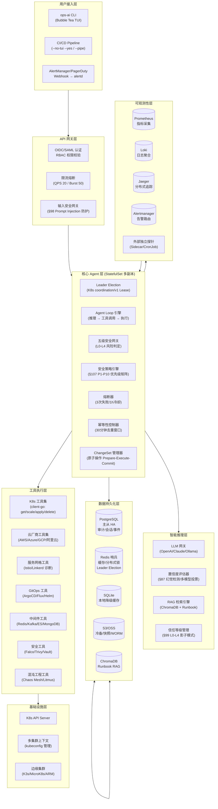

### 1.3 多副本高可用部署架构

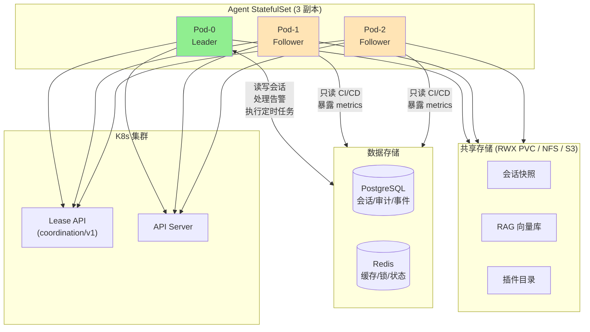

### 1.4 跨集群高可用架构 (v2.3 §112)

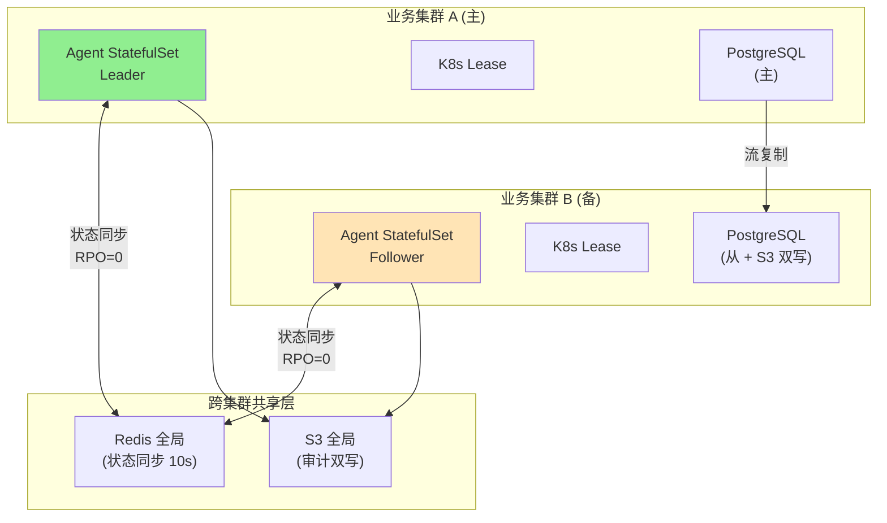

---

## 2. 核心业务逻辑流

### 2.1 核心 Agent Loop 流程

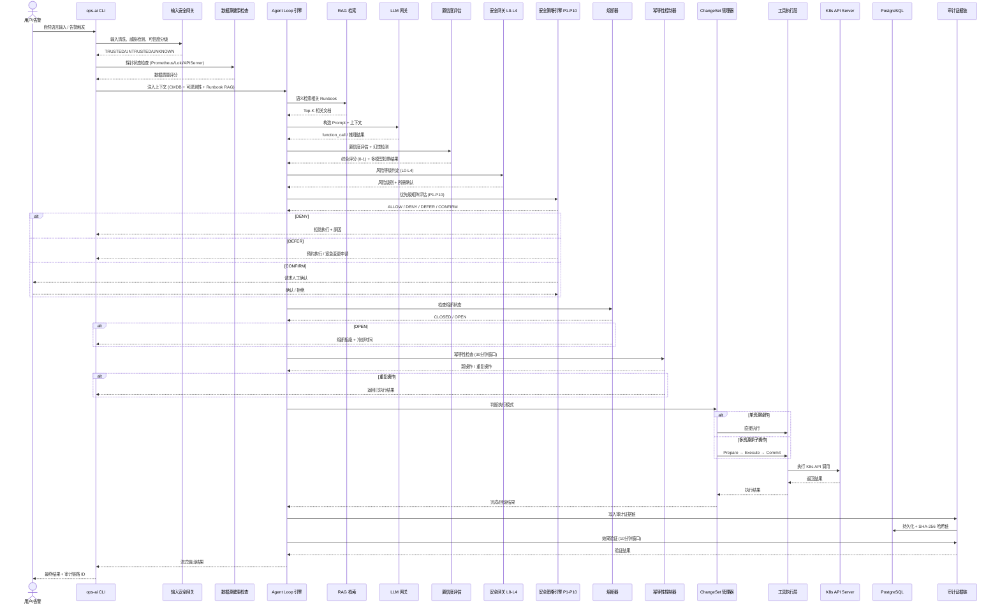

### 2.2 告警自动响应与修复流程

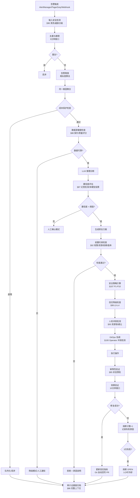

### 2.3 全局安全暂停机制流程

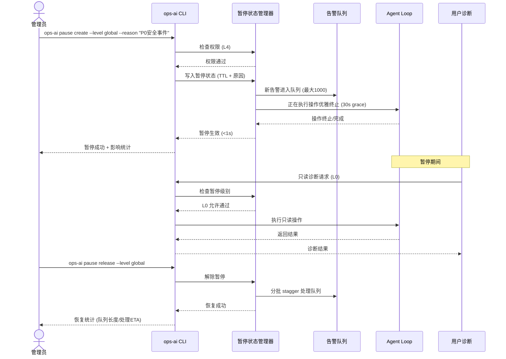

### 2.4 ChangeSet 原子操作流程

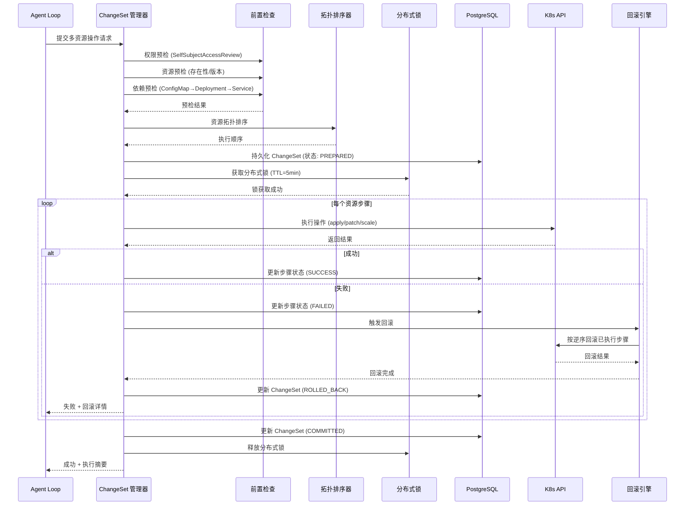

### 2.5 跨集群故障转移流程 (RTO < 10s)

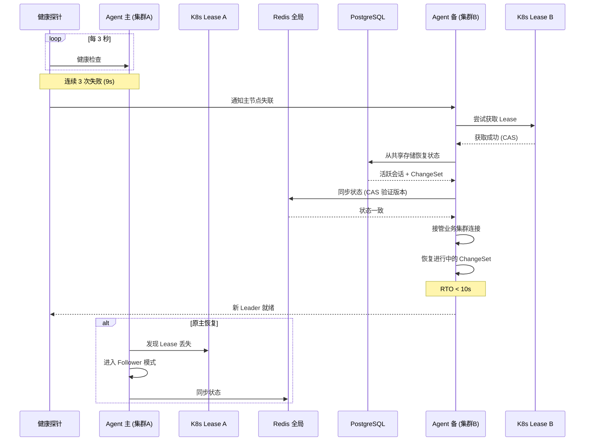

### 2.6 关键节点异常处理与兜底策略

| 节点 | 异常场景 | 处理策略 | 兜底机制 |
|------|---------|---------|---------|
| **输入安全** | Prompt Injection / 恶意输入 | 正则/关键词/控制字符清洗 | 威胁级别 Critical 直接 BLOCK，UNKNOWN 来源触发双因子确认 |
| **数据源健康** | Prometheus/APIServer 不可达 | 探针失败标记数据不可靠 | 降级到本地缓存数据 + 人工通知 |
| **LLM 推理** | 幻觉 / 低置信度 | 多模型投票 + 知识库校验 | 置信度 < 0.7 降级为建议模式，需人工确认 |
| **安全策略** | 高优先级冲突 | 按 P1-P10 矩阵逐层评估 | P9 全局暂停默认 DENY，P0 安全事件可紧急例外 |
| **熔断器** | 连续修复失败 | 3 次失败/1h 冷却 | OPEN 状态拒绝自动修复，保留只读诊断 |
| **幂等性** | 重复告警/重复操作 | 30 分钟去重窗口 | 返回已执行结果，避免重复变更 |
| **分布式锁** | 锁获取失败/网络分区 | 乐观并发控制 (CAS) | 网络分区降级为只读，禁止写操作 |
| **ChangeSet** | 部分资源执行失败 | 自动回滚已执行步骤 | 回滚失败触发告警 + 人工介入 |
| **跨集群切换** | 脑裂 (双主) | Lease CAS + 状态版本校验 | 旧主自动降级为 Follower，新主接管 |
| **审计存储** | PostgreSQL 写入失败 | 异步批量写入 + 降级队列 | SQLite 本地缓存 + 内存 ring buffer |
| **LLM 成本** | 预算超限 | 非 P0 告警动态降级模型 | P0 强制高质量模型（不计入预算） |

---

## 3. 数据库设计

### 3.1 核心实体 ER 图

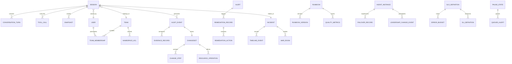

### 3.2 核心表 DDL 结构

```sql
-- ============================================================
-- 运维 AI Agent 核心数据库 Schema
-- PostgreSQL 15+
-- ============================================================

CREATE EXTENSION IF NOT EXISTS "uuid-ossp";
CREATE EXTENSION IF NOT EXISTS "pgcrypto";

-- 1. 用户与多租户
CREATE TABLE users (
    user_id         UUID PRIMARY KEY DEFAULT uuid_generate_v4(),
    username        VARCHAR(64) NOT NULL UNIQUE,
    email           VARCHAR(255) NOT NULL UNIQUE,
    role            VARCHAR(16) NOT NULL DEFAULT 'viewer' CHECK (role IN ('admin', 'operator', 'viewer')),
    oidc_claims     JSONB DEFAULT '{}',
    created_at      TIMESTAMPTZ NOT NULL DEFAULT NOW(),
    updated_at      TIMESTAMPTZ NOT NULL DEFAULT NOW()
);
CREATE INDEX idx_users_username ON users(username);
CREATE INDEX idx_users_email ON users(email);

CREATE TABLE teams (
    team_id             UUID PRIMARY KEY DEFAULT uuid_generate_v4(),
    name                VARCHAR(128) NOT NULL UNIQUE,
    allowed_namespaces  JSONB NOT NULL DEFAULT '[]',
    denied_namespaces   JSONB NOT NULL DEFAULT '[]',
    llm_budget_monthly  BIGINT NOT NULL DEFAULT 5000000,
    default_config      JSONB NOT NULL DEFAULT '{}',
    created_at          TIMESTAMPTZ NOT NULL DEFAULT NOW()
);

CREATE TABLE team_memberships (
    membership_id   UUID PRIMARY KEY DEFAULT uuid_generate_v4(),
    user_id         UUID NOT NULL REFERENCES users(user_id) ON DELETE CASCADE,
    team_id         UUID NOT NULL REFERENCES teams(team_id) ON DELETE CASCADE,
    role            VARCHAR(16) NOT NULL DEFAULT 'member' CHECK (role IN ('admin', 'member', 'viewer')),
    joined_at       TIMESTAMPTZ NOT NULL DEFAULT NOW(),
    UNIQUE(user_id, team_id)
);
CREATE INDEX idx_team_memberships_team ON team_memberships(team_id);
CREATE INDEX idx_team_memberships_user ON team_memberships(user_id);

CREATE TABLE namespace_acls (
    acl_id          UUID PRIMARY KEY DEFAULT uuid_generate_v4(),
    team_id         UUID NOT NULL REFERENCES teams(team_id) ON DELETE CASCADE,
    namespace_pattern VARCHAR(255) NOT NULL,
    access_type     VARCHAR(8) NOT NULL CHECK (access_type IN ('allow', 'deny')),
    created_at      TIMESTAMPTZ NOT NULL DEFAULT NOW(),
    UNIQUE(team_id, namespace_pattern)
);
CREATE INDEX idx_namespace_acls_team ON namespace_acls(team_id);

-- 2. 会话管理
CREATE TABLE sessions (
    session_id          UUID PRIMARY KEY DEFAULT uuid_generate_v4(),
    parent_session_id   UUID NULL REFERENCES sessions(session_id),
    cluster             VARCHAR(128) NOT NULL DEFAULT 'default',
    namespace           VARCHAR(128) NOT NULL DEFAULT 'default',
    environment         VARCHAR(32) NOT NULL DEFAULT 'production',
    status              VARCHAR(16) NOT NULL DEFAULT 'active' CHECK (status IN ('active', 'crashed', 'completed', 'exported', 'imported')),
    user_id             UUID REFERENCES users(user_id),
    team_id             UUID REFERENCES teams(team_id),
    incident_id         UUID,
    conversation_history JSONB NOT NULL DEFAULT '[]',
    tool_call_history   JSONB NOT NULL DEFAULT '[]',
    metadata            JSONB NOT NULL DEFAULT '{}',
    cost_usd_milli      BIGINT NOT NULL DEFAULT 0,
    token_budget_used   BIGINT NOT NULL DEFAULT 0,
    token_budget_limit  BIGINT NOT NULL DEFAULT 100000,
    created_at          TIMESTAMPTZ NOT NULL DEFAULT NOW(),
    updated_at          TIMESTAMPTZ NOT NULL DEFAULT NOW(),
    expires_at          TIMESTAMPTZ NOT NULL DEFAULT (NOW() + INTERVAL '24 hours')
);
CREATE INDEX idx_sessions_user ON sessions(user_id);
CREATE INDEX idx_sessions_team ON sessions(team_id);
CREATE INDEX idx_sessions_status ON sessions(status);
CREATE INDEX idx_sessions_expires ON sessions(expires_at);
CREATE INDEX idx_sessions_parent ON sessions(parent_session_id);

-- 3. 审计与证据链
CREATE TABLE audit_events (
    event_id            BIGSERIAL PRIMARY KEY,
    session_id          UUID REFERENCES sessions(session_id),
    user_id             UUID REFERENCES users(user_id),
    cluster             VARCHAR(128) NOT NULL,
    namespace           VARCHAR(128) NOT NULL,
    action              VARCHAR(64) NOT NULL,
    tool_name           VARCHAR(128),
    risk_level          VARCHAR(4) NOT NULL CHECK (risk_level IN ('L0', 'L1', 'L2', 'L3', 'L4')),
    target              JSONB NOT NULL DEFAULT '{}',
    pre_check           JSONB NOT NULL DEFAULT '{}',
    impact_analysis     JSONB NOT NULL DEFAULT '{}',
    result              JSONB NOT NULL DEFAULT '{}',
    rollback_info       JSONB,
    approval            JSONB,
    evidence_chain_hash VARCHAR(64),
    created_at          TIMESTAMPTZ NOT NULL DEFAULT NOW()
);
CREATE INDEX idx_audit_events_session ON audit_events(session_id);
CREATE INDEX idx_audit_events_user ON audit_events(user_id);
CREATE INDEX idx_audit_events_created ON audit_events(created_at);
CREATE INDEX idx_audit_events_cluster_ns ON audit_events(cluster, namespace);
CREATE INDEX idx_audit_events_risk ON audit_events(risk_level);
CREATE INDEX idx_audit_events_action ON audit_events(action);

CREATE TABLE evidence_records (
    evidence_id     BIGSERIAL PRIMARY KEY,
    event_id        BIGINT NOT NULL REFERENCES audit_events(event_id) ON DELETE CASCADE,
    evidence_type   VARCHAR(32) NOT NULL CHECK (evidence_type IN (
        'decision_context', 'system_state', 'resource_snapshot',
        'metrics_query', 'risk_assessment', 'approval'
    )),
    content         JSONB NOT NULL,
    content_hash    VARCHAR(64) NOT NULL,
    prev_hash       VARCHAR(64),
    created_at      TIMESTAMPTZ NOT NULL DEFAULT NOW()
);
CREATE INDEX idx_evidence_event ON evidence_records(event_id);
CREATE INDEX idx_evidence_type ON evidence_records(evidence_type);
CREATE INDEX idx_evidence_created ON evidence_records(created_at);

-- 4. 快照与回滚
CREATE TABLE snapshots (
    snapshot_id     UUID PRIMARY KEY DEFAULT uuid_generate_v4(),
    session_id      UUID NOT NULL REFERENCES sessions(session_id) ON DELETE CASCADE,
    resource_type   VARCHAR(64) NOT NULL,
    resource_name   VARCHAR(255) NOT NULL,
    namespace       VARCHAR(128) NOT NULL,
    content         TEXT,
    content_hash    VARCHAR(64),
    is_secret       BOOLEAN NOT NULL DEFAULT FALSE,
    encrypted_content BYTEA,
    created_at      TIMESTAMPTZ NOT NULL DEFAULT NOW()
);
CREATE INDEX idx_snapshots_session ON snapshots(session_id);
CREATE INDEX idx_snapshots_resource ON snapshots(resource_type, resource_name, namespace);

-- 5. 工具调用记录
CREATE TABLE tool_calls (
    call_id         UUID PRIMARY KEY DEFAULT uuid_generate_v4(),
    session_id      UUID NOT NULL REFERENCES sessions(session_id) ON DELETE CASCADE,
    tool_name       VARCHAR(128) NOT NULL,
    input           JSONB NOT NULL,
    result          JSONB,
    risk_level      VARCHAR(4) CHECK (risk_level IN ('L0', 'L1', 'L2', 'L3', 'L4')),
    duration_ms     INT,
    approved_by     UUID REFERENCES users(user_id),
    created_at      TIMESTAMPTZ NOT NULL DEFAULT NOW()
);
CREATE INDEX idx_tool_calls_session ON tool_calls(session_id);
CREATE INDEX idx_tool_calls_tool ON tool_calls(tool_name);
CREATE INDEX idx_tool_calls_created ON tool_calls(created_at);

-- 6. ChangeSet 原子操作
CREATE TABLE changesets (
    changeset_id        UUID PRIMARY KEY DEFAULT uuid_generate_v4(),
    session_id          UUID NOT NULL REFERENCES sessions(session_id),
    status              VARCHAR(16) NOT NULL DEFAULT 'PREPARED'
                        CHECK (status IN ('PREPARED', 'EXECUTING', 'COMMITTED', 'ROLLED_BACK', 'PARTIAL')),
    resources           JSONB NOT NULL DEFAULT '[]',
    topology_order      JSONB NOT NULL DEFAULT '[]',
    distributed_lock_key VARCHAR(128),
    prepared_at         TIMESTAMPTZ NOT NULL DEFAULT NOW(),
    executed_at         TIMESTAMPTZ,
    completed_at        TIMESTAMPTZ,
    created_at          TIMESTAMPTZ NOT NULL DEFAULT NOW()
);
CREATE INDEX idx_changesets_session ON changesets(session_id);
CREATE INDEX idx_changesets_status ON changesets(status);

CREATE TABLE change_steps (
    step_id         UUID PRIMARY KEY DEFAULT uuid_generate_v4(),
    changeset_id    UUID NOT NULL REFERENCES changesets(changeset_id) ON DELETE CASCADE,
    step_order      INT NOT NULL,
    resource_type   VARCHAR(64) NOT NULL,
    resource_name   VARCHAR(255) NOT NULL,
    namespace       VARCHAR(128) NOT NULL,
    action          VARCHAR(16) NOT NULL CHECK (action IN ('apply', 'patch', 'scale', 'delete', 'create')),
    status          VARCHAR(16) NOT NULL DEFAULT 'PENDING'
                        CHECK (status IN ('PENDING', 'SUCCESS', 'FAILED', 'ROLLED_BACK')),
    input           JSONB NOT NULL DEFAULT '{}',
    output          JSONB,
    created_at      TIMESTAMPTZ NOT NULL DEFAULT NOW(),
    completed_at    TIMESTAMPTZ,
    UNIQUE(changeset_id, step_order)
);
CREATE INDEX idx_change_steps_changeset ON change_steps(changeset_id);
CREATE INDEX idx_change_steps_status ON change_steps(status);

-- 7. 告警与修复
CREATE TABLE alerts (
    alert_id        UUID PRIMARY KEY DEFAULT uuid_generate_v4(),
    source          VARCHAR(32) NOT NULL,
    alertname       VARCHAR(128) NOT NULL,
    severity        VARCHAR(16) NOT NULL CHECK (severity IN ('critical', 'warning', 'info')),
    labels          JSONB NOT NULL DEFAULT '{}',
    annotations     JSONB NOT NULL DEFAULT '{}',
    status          VARCHAR(16) NOT NULL DEFAULT 'firing' CHECK (status IN ('firing', 'resolved', 'silenced', 'ignored')),
    dedup_hash      VARCHAR(64),
    cluster         VARCHAR(128),
    namespace       VARCHAR(128),
    fired_at        TIMESTAMPTZ NOT NULL DEFAULT NOW(),
    resolved_at     TIMESTAMPTZ
);
CREATE INDEX idx_alerts_status ON alerts(status);
CREATE INDEX idx_alerts_severity ON alerts(severity);
CREATE INDEX idx_alerts_dedup ON alerts(dedup_hash);
CREATE INDEX idx_alerts_fired ON alerts(fired_at);
CREATE INDEX idx_alerts_cluster_ns ON alerts(cluster, namespace);

CREATE TABLE remediation_records (
    remediation_id  UUID PRIMARY KEY DEFAULT uuid_generate_v4(),
    alert_id        UUID NOT NULL REFERENCES alerts(alert_id),
    session_id      UUID REFERENCES sessions(session_id),
    changeset_id    UUID REFERENCES changesets(changeset_id),
    status          VARCHAR(16) NOT NULL DEFAULT 'pending'
                        CHECK (status IN ('pending', 'executing', 'success', 'failed', 'blocked', 'cancelled')),
    confidence_score FLOAT,
    cost_usd_milli  BIGINT DEFAULT 0,
    created_at      TIMESTAMPTZ NOT NULL DEFAULT NOW(),
    completed_at    TIMESTAMPTZ
);
CREATE INDEX idx_remediation_alert ON remediation_records(alert_id);
CREATE INDEX idx_remediation_status ON remediation_records(status);
CREATE INDEX idx_remediation_created ON remediation_records(created_at);

CREATE TABLE remediation_actions (
    action_id       UUID PRIMARY KEY DEFAULT uuid_generate_v4(),
    remediation_id  UUID NOT NULL REFERENCES remediation_records(remediation_id) ON DELETE CASCADE,
    action_type     VARCHAR(64) NOT NULL,
    parameters      JSONB NOT NULL DEFAULT '{}',
    status          VARCHAR(16) NOT NULL DEFAULT 'pending'
                        CHECK (status IN ('pending', 'executing', 'success', 'failed')),
    retry_count     INT NOT NULL DEFAULT 0,
    created_at      TIMESTAMPTZ NOT NULL DEFAULT NOW(),
    completed_at    TIMESTAMPTZ
);
CREATE INDEX idx_remediation_actions_remediation ON remediation_actions(remediation_id);

-- 8. 事件管理
CREATE TABLE incidents (
    incident_id     UUID PRIMARY KEY DEFAULT uuid_generate_v4(),
    severity        VARCHAR(4) NOT NULL CHECK (severity IN ('P0', 'P1', 'P2', 'P3', 'P4')),
    status          VARCHAR(16) NOT NULL DEFAULT 'open' CHECK (status IN ('open', 'mitigated', 'resolved', 'closed')),
    commander_id    UUID REFERENCES users(user_id),
    responders      JSONB NOT NULL DEFAULT '[]',
    session_id      UUID REFERENCES sessions(session_id),
    slack_channel   VARCHAR(128),
    war_room_url    TEXT,
    root_cause      TEXT,
    action_items    JSONB NOT NULL DEFAULT '[]',
    created_at      TIMESTAMPTZ NOT NULL DEFAULT NOW(),
    resolved_at     TIMESTAMPTZ,
    closed_at       TIMESTAMPTZ
);
CREATE INDEX idx_incidents_severity ON incidents(severity);
CREATE INDEX idx_incidents_status ON incidents(status);
CREATE INDEX idx_incidents_commander ON incidents(commander_id);
CREATE INDEX idx_incidents_created ON incidents(created_at);

CREATE TABLE timeline_events (
    event_id        UUID PRIMARY KEY DEFAULT uuid_generate_v4(),
    incident_id     UUID NOT NULL REFERENCES incidents(incident_id) ON DELETE CASCADE,
    event_type      VARCHAR(32) NOT NULL CHECK (event_type IN ('alert', 'diagnosis', 'action', 'milestone', 'communication', 'system')),
    description     TEXT NOT NULL,
    metadata        JSONB NOT NULL DEFAULT '{}',
    created_at      TIMESTAMPTZ NOT NULL DEFAULT NOW()
);
CREATE INDEX idx_timeline_incident ON timeline_events(incident_id);
CREATE INDEX idx_timeline_created ON timeline_events(created_at);

-- 9. Runbook RAG
CREATE TABLE runbooks (
    runbook_id      UUID PRIMARY KEY DEFAULT uuid_generate_v4(),
    title           VARCHAR(255) NOT NULL,
    description     TEXT,
    tags            JSONB NOT NULL DEFAULT '[]',
    category        VARCHAR(32) CHECK (category IN ('kubernetes', 'networking', 'security', 'storage', 'chaos', 'database', 'general')),
    current_version_id UUID,
    created_at      TIMESTAMPTZ NOT NULL DEFAULT NOW(),
    updated_at      TIMESTAMPTZ NOT NULL DEFAULT NOW()
);
CREATE INDEX idx_runbooks_category ON runbooks(category);
CREATE INDEX idx_runbooks_tags ON runbooks USING GIN(tags);

CREATE TABLE runbook_versions (
    version_id      UUID PRIMARY KEY DEFAULT uuid_generate_v4(),
    runbook_id      UUID NOT NULL REFERENCES runbooks(runbook_id) ON DELETE CASCADE,
    version_tag     VARCHAR(32) NOT NULL,
    content         TEXT NOT NULL,
    content_embedding VECTOR(1536),
    validation_result JSONB,
    k8s_compat      VARCHAR(16),
    created_at      TIMESTAMPTZ NOT NULL DEFAULT NOW(),
    UNIQUE(runbook_id, version_tag)
);
CREATE INDEX idx_runbook_versions_runbook ON runbook_versions(runbook_id);

CREATE TABLE runbook_quality_metrics (
    metric_id       UUID PRIMARY KEY DEFAULT uuid_generate_v4(),
    runbook_id      UUID NOT NULL REFERENCES runbooks(runbook_id) ON DELETE CASCADE,
    success_rate    FLOAT NOT NULL DEFAULT 0,
    usage_frequency INT NOT NULL DEFAULT 0,
    user_rating     FLOAT NOT NULL DEFAULT 0,
    timeliness_score FLOAT NOT NULL DEFAULT 0,
    calculated_at   TIMESTAMPTZ NOT NULL DEFAULT NOW()
);
CREATE INDEX idx_runbook_quality_runbook ON runbook_quality_metrics(runbook_id);

-- 10. Agent 高可用
CREATE TABLE agent_instances (
    instance_id         UUID PRIMARY KEY DEFAULT uuid_generate_v4(),
    cluster             VARCHAR(128) NOT NULL,
    pod_name            VARCHAR(128) NOT NULL,
    role                VARCHAR(16) NOT NULL DEFAULT 'Follower' CHECK (role IN ('Leader', 'Follower', 'Candidate')),
    lease_holder_identity VARCHAR(128),
    version             VARCHAR(32) NOT NULL,
    started_at          TIMESTAMPTZ NOT NULL DEFAULT NOW(),
    last_heartbeat      TIMESTAMPTZ NOT NULL DEFAULT NOW()
);
CREATE INDEX idx_agent_instances_cluster ON agent_instances(cluster);
CREATE INDEX idx_agent_instances_role ON agent_instances(role);

CREATE TABLE failover_records (
    failover_id     UUID PRIMARY KEY DEFAULT uuid_generate_v4(),
    from_instance_id UUID REFERENCES agent_instances(instance_id),
    to_instance_id  UUID NOT NULL REFERENCES agent_instances(instance_id),
    reason          VARCHAR(32) NOT NULL CHECK (reason IN ('health_check_failed', 'lease_expired', 'manual', 'network_partition')),
    rto_ms          INT,
    state_recovered BOOLEAN NOT NULL DEFAULT FALSE,
    occurred_at     TIMESTAMPTZ NOT NULL DEFAULT NOW()
);
CREATE INDEX idx_failover_from ON failover_records(from_instance_id);
CREATE INDEX idx_failover_to ON failover_records(to_instance_id);

-- 11. SLO / 错误预算
CREATE TABLE slo_definitions (
    slo_id          UUID PRIMARY KEY DEFAULT uuid_generate_v4(),
    service_name    VARCHAR(128) NOT NULL,
    slo_name        VARCHAR(128) NOT NULL,
    description     TEXT,
    target_percentage FLOAT NOT NULL DEFAULT 99.9,
    time_window     INTERVAL NOT NULL DEFAULT '30 days',
    created_at      TIMESTAMPTZ NOT NULL DEFAULT NOW(),
    UNIQUE(service_name, slo_name)
);
CREATE INDEX idx_slo_service ON slo_definitions(service_name);

CREATE TABLE sli_definitions (
    sli_id          UUID PRIMARY KEY DEFAULT uuid_generate_v4(),
    slo_id          UUID NOT NULL REFERENCES slo_definitions(slo_id) ON DELETE CASCADE,
    sli_name        VARCHAR(128) NOT NULL,
    promql_query    TEXT NOT NULL,
    sli_type        VARCHAR(16) NOT NULL CHECK (sli_type IN ('availability', 'latency', 'throughput', 'error_rate')),
    created_at      TIMESTAMPTZ NOT NULL DEFAULT NOW()
);
CREATE INDEX idx_sli_slo ON sli_definitions(slo_id);

CREATE TABLE error_budgets (
    budget_id       UUID PRIMARY KEY DEFAULT uuid_generate_v4(),
    slo_id          UUID NOT NULL REFERENCES slo_definitions(slo_id) ON DELETE CASCADE,
    total_budget    FLOAT NOT NULL,
    consumed_budget FLOAT NOT NULL DEFAULT 0,
    remaining_budget FLOAT NOT NULL,
    status          VARCHAR(16) NOT NULL DEFAULT 'healthy' CHECK (status IN ('healthy', 'at_risk', 'depleted')),
    window_start    TIMESTAMPTZ NOT NULL,
    window_end      TIMESTAMPTZ NOT NULL,
    created_at      TIMESTAMPTZ NOT NULL DEFAULT NOW()
);
CREATE INDEX idx_error_budget_slo ON error_budgets(slo_id);
CREATE INDEX idx_error_budget_window ON error_budgets(window_start, window_end);

-- 12. 全局暂停
CREATE TABLE pause_states (
    pause_id        UUID PRIMARY KEY DEFAULT uuid_generate_v4(),
    level           VARCHAR(16) NOT NULL CHECK (level IN ('global', 'cluster', 'namespace', 'operation')),
    scope           VARCHAR(255) NOT NULL,
    status          VARCHAR(16) NOT NULL DEFAULT 'active' CHECK (status IN ('active', 'released')),
    reason          TEXT NOT NULL,
    created_by      UUID NOT NULL REFERENCES users(user_id),
    released_by     UUID REFERENCES users(user_id),
    created_at      TIMESTAMPTZ NOT NULL DEFAULT NOW(),
    expires_at      TIMESTAMPTZ,
    released_at     TIMESTAMPTZ
);
CREATE INDEX idx_pause_level ON pause_states(level);
CREATE INDEX idx_pause_status ON pause_states(status);
CREATE INDEX idx_pause_scope ON pause_states(scope);
CREATE INDEX idx_pause_active ON pause_states(status, level, scope) WHERE status = 'active';

CREATE TABLE queued_alerts (
    queue_id        UUID PRIMARY KEY DEFAULT uuid_generate_v4(),
    pause_id        UUID NOT NULL REFERENCES pause_states(pause_id) ON DELETE CASCADE,
    alert_id        UUID NOT NULL REFERENCES alerts(alert_id),
    queue_position  INT NOT NULL,
    queued_at       TIMESTAMPTZ NOT NULL DEFAULT NOW(),
    processed_at    TIMESTAMPTZ
);
CREATE INDEX idx_queued_pause ON queued_alerts(pause_id);
CREATE INDEX idx_queued_position ON queued_alerts(pause_id, queue_position);

-- 13. 成本追踪
CREATE TABLE usage_records (
    record_id       UUID PRIMARY KEY DEFAULT uuid_generate_v4(),
    session_id      UUID REFERENCES sessions(session_id),
    user_id         UUID NOT NULL REFERENCES users(user_id),
    team_id         UUID REFERENCES teams(team_id),
    model           VARCHAR(64) NOT NULL,
    operation       VARCHAR(64) NOT NULL,
    input_tokens    BIGINT NOT NULL DEFAULT 0,
    output_tokens   BIGINT NOT NULL DEFAULT 0,
    cost_usd_milli  BIGINT NOT NULL DEFAULT 0,
    created_at      TIMESTAMPTZ NOT NULL DEFAULT NOW()
);
CREATE INDEX idx_usage_user ON usage_records(user_id);
CREATE INDEX idx_usage_team ON usage_records(team_id);
CREATE INDEX idx_usage_created ON usage_records(created_at);
CREATE INDEX idx_usage_session ON usage_records(session_id);

-- 14. 信任等级与影子模式
CREATE TABLE trust_levels (
    trust_id        UUID PRIMARY KEY DEFAULT uuid_generate_v4(),
    cluster         VARCHAR(128) NOT NULL,
    namespace       VARCHAR(128) NOT NULL DEFAULT '*',
    current_level   VARCHAR(4) NOT NULL DEFAULT 'L0' CHECK (current_level IN ('L0', 'L1', 'L2', 'L3', 'L4')),
    shadow_success_rate FLOAT NOT NULL DEFAULT 0,
    shadow_executions INT NOT NULL DEFAULT 0,
    shadow_successes INT NOT NULL DEFAULT 0,
    drill_success_rate FLOAT NOT NULL DEFAULT 0,
    manual_approved_at TIMESTAMPTZ,
    created_at      TIMESTAMPTZ NOT NULL DEFAULT NOW(),
    updated_at      TIMESTAMPTZ NOT NULL DEFAULT NOW(),
    UNIQUE(cluster, namespace)
);
CREATE INDEX idx_trust_cluster_ns ON trust_levels(cluster, namespace);

CREATE TABLE shadow_results (
    result_id       UUID PRIMARY KEY DEFAULT uuid_generate_v4(),
    trust_id        UUID NOT NULL REFERENCES trust_levels(trust_id),
    alert_id        UUID REFERENCES alerts(alert_id),
    proposed_action JSONB NOT NULL,
    actual_result   JSONB,
    matched         BOOLEAN,
    created_at      TIMESTAMPTZ NOT NULL DEFAULT NOW()
);
CREATE INDEX idx_shadow_trust ON shadow_results(trust_id);

-- 触发器: 更新时间戳
CREATE OR REPLACE FUNCTION update_updated_at_column()
RETURNS TRIGGER AS $$
BEGIN
    NEW.updated_at = NOW();
    RETURN NEW;
END;
$$ language 'plpgsql';

CREATE TRIGGER update_users_updated_at BEFORE UPDATE ON users
    FOR EACH ROW EXECUTE FUNCTION update_updated_at_column();
CREATE TRIGGER update_sessions_updated_at BEFORE UPDATE ON sessions
    FOR EACH ROW EXECUTE FUNCTION update_updated_at_column();
CREATE TRIGGER update_runbooks_updated_at BEFORE UPDATE ON runbooks
    FOR EACH ROW EXECUTE FUNCTION update_updated_at_column();
CREATE TRIGGER update_trust_levels_updated_at BEFORE UPDATE ON trust_levels
    FOR EACH ROW EXECUTE FUNCTION update_updated_at_column();

-- 触发器: 审计事件哈希链
CREATE OR REPLACE FUNCTION compute_evidence_hash()
RETURNS TRIGGER AS $$
DECLARE
    prev_hash_val VARCHAR(64);
BEGIN
    SELECT content_hash INTO prev_hash_val
    FROM evidence_records
    WHERE event_id = NEW.event_id AND evidence_id < NEW.evidence_id
    ORDER BY evidence_id DESC LIMIT 1;

    NEW.prev_hash := COALESCE(prev_hash_val, '');
    NEW.content_hash := encode(digest(NEW.content::text || NEW.prev_hash, 'sha256'), 'hex');
    RETURN NEW;
END;
$$ language 'plpgsql';

CREATE TRIGGER trg_evidence_hash BEFORE INSERT ON evidence_records
    FOR EACH ROW EXECUTE FUNCTION compute_evidence_hash();
```

### 3.3 分库分表与数据归档策略

#### 3.3.1 分库分表策略

| 场景 | 策略 | 理由 |
|------|------|------|
| **审计事件 (audit_events)** | 按 `created_at` 月分区 | 审计数据量最大，月分区便于归档与清理 |
| **证据记录 (evidence_records)** | 按 `created_at` 月分区 | 随审计事件分区对齐，保证哈希链完整性 |
| **使用记录 (usage_records)** | 按 `created_at` 月分区 | 成本追踪数据，按团队/用户聚合查询 |
| **多租户数据** | Row-Level Security (RLS) | PostgreSQL 原生 RLS 实现团队级隔离，避免分库复杂度 |

#### 3.3.2 读写分离策略

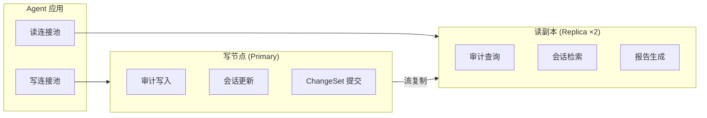

- **写操作**：审计事件插入、会话状态更新、ChangeSet 状态变更 → Primary 节点
- **读操作**：历史审计查询、报告生成、只读诊断数据 → Replica 节点
- **连接池配置**：写池 max_open=20，读池 max_open=50

#### 3.3.3 数据归档策略

| 数据类型 | 保留周期 | 归档目标 | 清理方式 |
|---------|---------|---------|---------|
| 审计事件 (audit_events) | 1 年 | S3 WORM 存储 | 分区 DETACH + 归档后 DROP |
| 证据记录 (evidence_records) | 1 年 | S3 WORM 存储 | 与审计事件同步归档 |
| 会话历史 (sessions) | 90 天 | S3 标准存储 | 过期标记 + 异步清理 |
| 快照 (snapshots) | 30 天 | S3 标准存储 | 过期自动删除 |
| 告警 (alerts) | 90 天 | 本地压缩 | 分区清理 |
| 使用记录 (usage_records) | 2 年 | S3 标准存储 | 月分区归档 |
| 修复记录 (remediation_records) | 1 年 | S3 标准存储 | 分区清理 |

---

## 4. API 接口定义

### 4.1 接口设计原则

- **RESTful 风格**：资源为核心，HTTP 方法表达操作语义
- **统一响应格式**：`{ "code": 0, "message": "", "data": {}, "request_id": "" }`
- **版本控制**：URL 路径前缀 `/api/v2/`
- **认证方式**：Bearer Token (OIDC JWT) + API Key (CI/CD 场景)
- **幂等性**：写操作通过 `Idempotency-Key` Header 保障

### 4.2 核心接口契约

#### 4.2.1 会话管理

**创建会话**
```
POST /api/v2/sessions
Header: Authorization: Bearer <jwt>
Body: { "cluster": "prod-cluster-1", "namespace": "default", "environment": "production" }
Resp 200: { "code": 0, "data": { "session_id": "uuid", "status": "active" } }
Resp 403: { "code": 403001, "message": "namespace denied by ACL" }
```

**获取会话详情**
```
GET /api/v2/sessions/{session_id}
Resp 200: { "code": 0, "data": { "session_id": "", "status": "", "conversation_history": [], "snapshots": [] } }
```

**导出会话**
```
POST /api/v2/sessions/{session_id}/export
Body: { "include_snapshots": true }
Resp 200: { "code": 0, "data": { "export_url": "s3://..." } }
```

**导入会话**
```
POST /api/v2/sessions/import
Body: { "import_source": "s3://..." }
Resp 200: { "code": 0, "data": { "session_id": "new-uuid" } }
```

---

#### 4.2.2 对话与推理

**发送消息（流式）**
```
POST /api/v2/sessions/{session_id}/chat
Header: Authorization: Bearer <jwt>, Accept: text/event-stream
Body: { "message": "排查 nginx Pod 重启原因", "streaming": true }
Resp 200: SSE 流 { "type": "thinking"/"tool_call"/"result", "content": "...", "audit_event_id": 12345 }
Resp 400: { "code": 400001, "message": "potential prompt injection pattern" }
Resp 402: { "code": 402001, "message": "token budget exceeded" }
```

**工具调用确认（L2+ 操作）**
```
POST /api/v2/sessions/{session_id}/confirm
Body: { "pending_tool_call_id": "uuid", "decision": "approve" }
Resp 200: { "code": 0, "data": { "execution_result": {}, "audit_event_id": 12345 } }
Resp 403: { "code": 403002, "message": "insufficient trust level for L3 operation" }
```

---

#### 4.2.3 告警与修复

**接收告警 Webhook**
```
POST /api/v2/alerts/webhook
Header: X-Webhook-Source: alertmanager, X-Webhook-Signature: sha256=...
Body: AlertManager Webhook Payload
Resp 200: { "code": 0, "data": { "alert_id": "uuid", "remediation_status": "pending" } }
Resp 202: { "code": 0, "data": { "remediation_status": "deferred: global pause active" } }
Resp 503: { "code": 503001, "message": "alert queue full (max 1000)" }
```

**获取告警列表**
```
GET /api/v2/alerts?status=firing&severity=critical&limit=50&offset=0
Resp 200: { "code": 0, "data": { "items": [], "total": 100 } }
```

**手动触发修复**
```
POST /api/v2/alerts/{alert_id}/remediate
Header: Idempotency-Key: unique-key
Body: { "strategy": "auto", "dry_run": false }
Resp 200: { "code": 0, "data": { "remediation_id": "uuid", "status": "executing" } }
Resp 409: { "code": 409001, "message": "remediation already in progress" }
```

---

#### 4.2.4 ChangeSet 原子操作

**创建 ChangeSet**
```
POST /api/v2/changesets
Header: Idempotency-Key: unique-key
Body: { "session_id": "uuid", "resources": [{ "type": "Deployment", "name": "nginx", "action": "scale", "input": { "replicas": 5 } }], "dry_run": true }
Resp 200: { "code": 0, "data": { "changeset_id": "uuid", "status": "PREPARED" } }
```

**执行 ChangeSet**
```
POST /api/v2/changesets/{changeset_id}/execute
Body: { "confirm": true, "timeout_seconds": 300 }
Resp 200: { "code": 0, "data": { "status": "COMMITTED" } }
Resp 409: { "code": 409002, "message": "changeset already executing" }
Resp 500: { "code": 500001, "message": "partial failure, rollback initiated" }
```

**回滚 ChangeSet**
```
POST /api/v2/changesets/{changeset_id}/rollback
Resp 200: { "code": 0, "data": { "status": "ROLLED_BACK" } }
```

---

#### 4.2.5 全局暂停

**创建暂停**
```
POST /api/v2/pauses
Body: { "level": "namespace", "scope": "production", "reason": "P0 incident", "expires_at": "2024-01-01T06:00:00Z" }
Resp 200: { "code": 0, "data": { "pause_id": "uuid", "status": "active" } }
Resp 403: { "code": 403003, "message": "only L4 admin can create global pause" }
```

**解除暂停**
```
POST /api/v2/pauses/{pause_id}/release
Body: { "reason": "incident resolved" }
Resp 200: { "code": 0, "data": { "status": "released", "queued_alerts_processed": 23 } }
```

**获取活跃暂停列表**
```
GET /api/v2/pauses?status=active
Resp 200: { "code": 0, "data": { "items": [{ "pause_id": "", "level": "", "scope": "" }] } }
```

---

#### 4.2.6 审计与证据链

**查询审计事件**
```
GET /api/v2/audit/events?session_id=&cluster=&namespace=&risk_level=&from=&to=&limit=50
Resp 200: { "code": 0, "data": { "items": [{ "event_id": 123, "risk_level": "L3", "evidence_chain_hash": "sha256..." }] } }
```

**获取证据链详情**
```
GET /api/v2/audit/events/{event_id}/evidence
Resp 200: { "code": 0, "data": { "event_id": 123, "evidence_chain": [...], "integrity_verified": true } }
```

**验证证据链完整性**
```
POST /api/v2/audit/verify
Body: { "event_id": 123, "expected_hash": "sha256..." }
Resp 200: { "code": 0, "data": { "verified": true, "chain_length": 5 } }
Resp 400: { "code": 400002, "data": { "verified": false, "broken_at": 3 } }
```

---

#### 4.2.7 事件管理 (Incident)

**创建事件**
```
POST /api/v2/incidents
Body: { "severity": "P0", "title": "prod checkout down", "session_id": "uuid", "auto_create_war_room": true }
Resp 200: { "code": 0, "data": { "incident_id": "uuid", "status": "open", "war_room_url": "..." } }
```

**更新事件状态**
```
PATCH /api/v2/incidents/{incident_id}
Body: { "status": "resolved", "root_cause": "DB pool exhausted" }
Resp 200: { "code": 0, "data": { "status": "resolved", "resolved_at": "" } }
```

---

#### 4.2.8 信任等级与影子模式

**获取信任等级**
```
GET /api/v2/trust-levels?cluster=&namespace=
Resp 200: { "code": 0, "data": { "current_level": "L2", "shadow_success_rate": 0.92 } }
```

**申请升级信任等级**
```
POST /api/v2/trust-levels/{trust_id}/upgrade
Body: { "target_level": "L3", "justification": "shadow success rate > 90%" }
Resp 200: { "code": 0, "data": { "current_level": "L3" } }
Resp 403: { "code": 403004, "message": "shadow success rate 85% below threshold 90%" }
```

**影子模式对比结果**
```
GET /api/v2/trust-levels/{trust_id}/shadow-results?limit=50
Resp 200: { "code": 0, "data": { "items": [...], "match_rate": 0.92 } }
```

---

#### 4.2.9 配置与管理

**获取 Agent 配置**
```
GET /api/v2/config
Resp 200: { "code": 0, "data": { "schema_version": "v2.3.0", "remediation": {} } }
```

**更新 Agent 配置**
```
PATCH /api/v2/config
Body: { "schema_version": "v2.3.0", "remediation": { "circuit_breaker_threshold": 3 } }
Resp 200: { "code": 0, "data": { "applied": true } }
Resp 400: { "code": 400003, "message": "schema_version mismatch" }
```

**Agent 健康检查**
```
GET /api/v2/health
Resp 200: { "code": 0, "data": { "status": "healthy", "role": "Leader", "checks": {} } }
Resp 503: { "code": 503002, "data": { "status": "degraded" } }
```

**Agent 指标**
```
GET /api/v2/metrics
Resp 200: Prometheus Exposition Format
```

---

### 4.3 统一错误码定义

| 错误码 | HTTP 状态 | 含义 | 业务场景 |
|--------|----------|------|---------|
| 0 | 200 | 成功 | — |
| 400001 | 400 | 输入包含 Prompt Injection 模式 | §98 输入安全检查失败 |
| 400002 | 400 | 证据链验证失败 | 哈希不匹配 |
| 400003 | 400 | 配置 Schema 版本不匹配 | §104 版本控制 |
| 401001 | 401 | Token 过期或无效 | 认证失败 |
| 403001 | 403 | Namespace 被 ACL 拒绝 | 多租户隔离 |
| 403002 | 403 | 信任等级不足 | §99 L1 请求 L3 操作 |
| 403003 | 403 | 权限不足创建全局暂停 | 非 L4 管理员 |
| 403004 | 403 | 影子模式指标未达标 | 信任升级被拒绝 |
| 404001 | 404 | 会话不存在 | — |
| 404002 | 404 | ChangeSet 不存在 | — |
| 409001 | 409 | 告警修复已在进行中 | 幂等性冲突 |
| 409002 | 409 | ChangeSet 已在执行 | 并发冲突 |
| 409003 | 409 | 人机操作冲突 | §93 资源锁冲突 |
| 429001 | 429 | 团队会话数超限 | 限流 |
| 429002 | 429 | API Server QPS 超限 | K8s 限流 |
| 429003 | 429 | LLM 请求频率超限 | 成本保护 |
| 429004 | 429 | 熔断器 OPEN | §85 熔断拒绝 |
| 429005 | 429 | 全局暂停中，操作被拒绝 | §102 安全暂停 |
| 500001 | 500 | ChangeSet 部分失败已回滚 | 原子操作回滚 |
| 500002 | 500 | 审计写入降级到 SQLite | PostgreSQL 故障 |
| 502001 | 502 | LLM 服务不可用 | 模型服务故障 |
| 502002 | 502 | K8s API Server 不可达 | 集群故障 |
| 503001 | 503 | 告警队列已满 (1000) | 过载保护 |
| 503002 | 503 | Agent 降级运行 | 依赖故障 |

---

## 5. 非功能性设计

### 5.1 高可用设计

#### 5.1.1 Agent 自身高可用

| 维度 | 设计 | 指标 |
|------|------|------|
| **部署模式** | K8s StatefulSet 3 副本 | — |
| **Leader 选举** | K8s `coordination/v1` Lease API | 选举耗时 5-10s |
| **故障检测** | 健康探针每 3s，连续 3 次失败判定失联 | 检测耗时 9s |
| **故障转移 (RTO)** | Follower 竞选 Leader + 状态恢复 | **< 10s** |
| **状态持久化 (RPO)** | 会话/ChangeSet 实时写入 PostgreSQL + Redis | **RPO = 0** |
| **跨集群切换** | 多集群主备 + 全局 Redis 状态同步 (10s 间隔) + S3 审计双写 | 脑裂防护：CAS 验证 |
| **优雅终止** | SIGTERM 30s grace period，活跃会话持久化后退出 | — |

#### 5.1.2 数据存储高可用

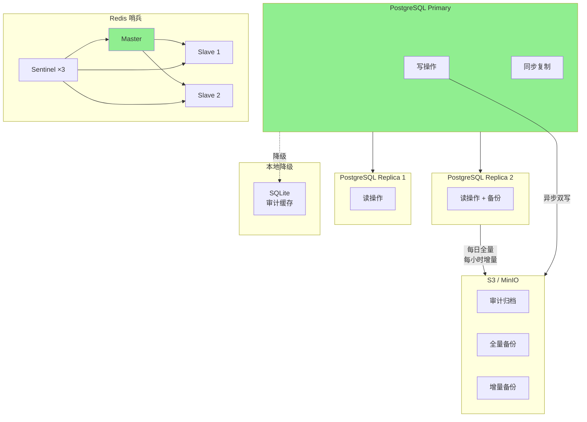

**PostgreSQL 主从切换策略**：
- 同步流复制：至少 1 个同步备库，保证 RPO=0
- 自动故障切换：patroni / repmgr，切换耗时 < 30s
- 监控指标：`pg_stat_replication.lag` > 1s 触发告警

**Redis 哨兵故障切换**：
- 3 哨兵节点，quorum=2
- 主观下线 (SDOWN)：1 个哨兵判定 Master 不可达
- 客观下线 (ODOWN)：>= quorum 哨兵同意
- 自动选举新 Master，切换耗时 < 10s

### 5.2 安全设计

#### 5.2.1 分层安全架构

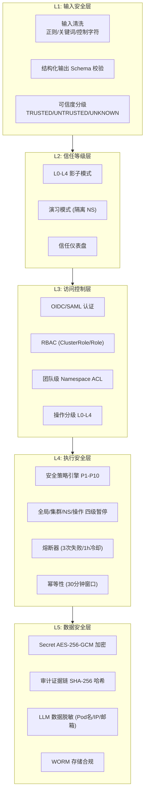

#### 5.2.2 安全策略引擎优先级矩阵 (P1-P10)

| 优先级 | 安全机制 | 决策动作 | 例外条件 |
|--------|---------|---------|---------|
| **P10** | 紧急安全事件 | BLOCK + 告警 | — |
| **P9** | 全局暂停 | DENY | P0 安全事件可覆盖 |
| **P8** | 输入安全 | BLOCK (Critical) / CONFIRM (Unknown) | — |
| **P7** | 信任等级 | CONFIRM (L1) / ALLOW (L2-L4) | — |
| **P6** | RBAC 权限 | DENY | — |
| **P5** | 熔断器 | DENY (OPEN) | — |
| **P4** | GitOps 同步 | DEFER (同步中) | P0 可覆盖 |
| **P3** | ChangeSet 预检 | DENY (预检失败) | — |
| **P2** | 业务高峰期 | CONFIRM/DEFER | — |
| **P1** | 成本控制 | THROTTLE | P0 可覆盖 |

**冲突解决规则**：高优先级覆盖低优先级；同优先级按 "DENY > DEFER > CONFIRM > ALLOW" 顺序。

#### 5.2.3 Secret 与敏感数据处理

| 层级 | 处理策略 | 实现方式 |
|------|---------|---------|
| **LLM 输入层** | Pod 名/IP/邮箱/Secret 值脱敏 | 正则替换为 `<REDACTED_podname>` |
| **Agent 处理层** | Secret 资源 YAML 不进入 LLM Prompt | 检测到 `kind: Secret` 直接跳过 |
| **审计存储层** | Secret 快照 AES-256-GCM 加密 | 独立加密密钥 (K8s Secret 或 Vault) |
| **日志输出层** | 审计日志中 Secret 值哈希化 | SHA-256 单向哈希 |

### 5.3 性能设计

#### 5.3.1 缓存策略

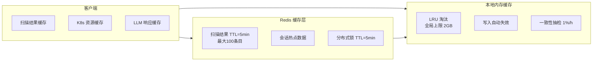

**缓存治理策略**：

| 缓存类型 | 容量上限 | 淘汰策略 | 一致性机制 |
|---------|---------|---------|-----------|
| 扫描结果 | 100 条目 | TTL 5min | 手动失效 + 定时清理 |
| K8s 资源列表 | 200 条目 | TTL 2min | informer watch 增量更新 |
| LLM Prompt 响应 | 50 条目 | LRU | 不缓存（避免幻觉累积） |
| 会话上下文 | 无限制（按会话） | 会话过期清除 | — |
| 全局内存 | 2GB 硬上限 | LRU + LFU 混合 | 内存 > 90% 告警，> 105% 强制驱逐 |

#### 5.3.2 限流与熔断

**API Server 限流**：
```go
config.QPS = 20
config.Burst = 50
if nodeCount > 500 {
    config.QPS = 10
    config.Burst = 25
}
```

**告警风暴保护**：
- 每分钟最多 5 个自动修复会话
- 单次告警风暴成本上限 $10
- 超过阈值：队列化 + 人工通知

**LLM 成本限流**：
- 单会话 Token 上限：默认 100K
- 单会话成本上限：默认 $5 (5000 milli)
- 月度预算告警：50%(log) / 75%(Slack) / 90%(PagerDuty) / 100%(throttle)
- P0 告警强制使用高质量模型，不计入预算

**熔断器配置**：
```yaml
remediation:
  circuit_breaker:
    failure_threshold: 3
    cooldown_period: "1h"
    half_open_max_calls: 1
    effect_verification_window: "10m"
```

#### 5.3.3 大规模集群性能优化

| 优化手段 | 触发条件 | 具体措施 |
|---------|---------|---------|
| **扫描结果缓存** | 500+ 节点 | TTL 5min，最大 100 条目 |
| **分页列表** | 所有列表操作 | 默认 200/最大 500 |
| **增量扫描** | resourceVersion 支持 | informer ListWatch 替代全量 |
| **影响面分析限制** | 复杂依赖图 | 最大深度 3，每层最大 20 节点 |
| **审计批量写入** | 高并发场景 | 每批 100 条，最长 5s flush |
| **轻量级模式** | CPU < 4核 或 内存 < 8GB | 禁用 RAG/合规扫描/混沌工程，内存限制 128MB |
| **并发控制** | 资源操作 | 分布式锁 (K8s Lease / Redis) |

### 5.4 数据一致性保障

#### 5.4.1 分布式一致性策略

| 场景 | 一致性模型 | 实现机制 |
|------|-----------|---------|
| **审计事件写入** | 最终一致性 | 异步批量写入 PostgreSQL，失败降级 SQLite |
| **证据链哈希** | 强一致性 | 数据库触发器 + 事务内计算 |
| **ChangeSet 执行** | 强一致性 | 分布式锁 + 两阶段提交 |
| **会话状态** | 强一致性 | PostgreSQL 事务 + Redis 缓存同步 |
| **Leader Election** | 强一致性 | K8s Lease API (基于 etcd) |
| **跨集群状态** | 最终一致性 | Redis 全局缓存 10s 同步 + PostgreSQL 流复制 |

#### 5.4.2 数据一致性抽检

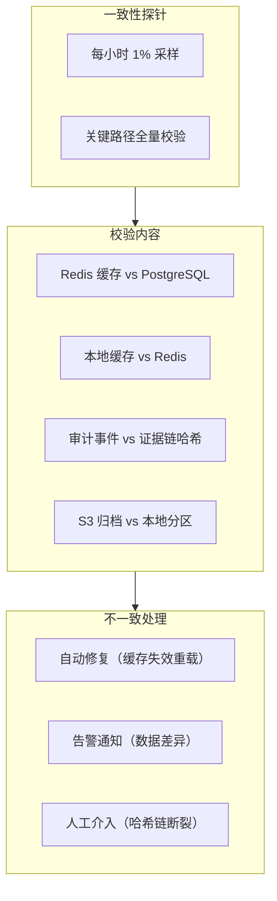

### 5.5 可观测性设计

#### 5.5.1 指标暴露 (Prometheus)

```
ops_ai_agent_role{pod="ops-ai-0"} 1
ops_ai_sessions_active 15
ops_ai_llm_requests_total{model="gpt-4o",status="success"} 500
ops_ai_llm_latency_seconds_bucket{le="1.0"} 450
ops_ai_tool_calls_total{tool="kubectl_scale",risk_level="L2"} 200
ops_ai_audit_events_total{action="apply",risk_level="L3"} 50
ops_ai_changesets_total{status="COMMITTED"} 30
ops_ai_circuit_breaker_state{name="remediation"} 0
ops_ai_trust_level{cluster="prod",namespace="default"} 2
ops_ai_pause_active{level="namespace"} 1
ops_ai_alert_queue_length 23
ops_ai_cost_usd_milli_total{team="platform"} 500000
ops_ai_probe_health{probe="k8s_api"} 1
```

#### 5.5.2 分布式追踪 (Jaeger)

| Trace 名称 | Span 覆盖 | 采样策略 |
|-----------|----------|---------|
| `agent_loop` | 输入 → 安全 → LLM → 工具 → 审计 | 100% (P0 告警) / 10% (普通对话) |
| `remediation` | 告警接收 → 诊断 → 修复 → 验证 | 100% |
| `changeset` | Prepare → Execute → Commit/Rollback | 100% |
| `failover` | 健康检查 → 选举 → 状态恢复 | 100% |

#### 5.5.3 日志规范 (Loki)

```json
{
  "timestamp": "2024-01-01T00:00:00Z",
  "level": "INFO",
  "component": "agent_loop",
  "session_id": "uuid",
  "trace_id": "jaeger-trace-id",
  "span_id": "jaeger-span-id",
  "user_id": "uuid",
  "team_id": "uuid",
  "cluster": "prod-cluster-1",
  "namespace": "default",
  "event": "tool_call_executed",
  "tool_name": "kubectl_scale",
  "risk_level": "L2",
  "duration_ms": 150,
  "message": "Deployment nginx scaled to 5 replicas"
}
```

### 5.6 灾备与恢复

#### 5.6.1 四级灾备体系

| 级别 | 目标 | RTO | RPO | 方案 |
|------|------|-----|-----|------|
| **L1: 实例故障** | 单 Pod 故障 | < 10s | 0 | StatefulSet 多副本 + Leader Election |
| **L2: 集群故障** | K8s 集群不可用 | < 30s | 0 | 跨集群主备 + PostgreSQL 流复制 |
| **L3: 区域故障** | 可用区不可用 | < 5min | < 1min | S3 跨区复制 + 异地备集群 |
| **L4: 数据损坏** | 数据误删/篡改 | < 1h | < 1h | S3 版本控制 + WORM + 定期备份校验 |

#### 5.6.2 降级策略矩阵

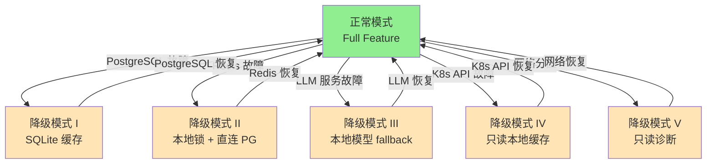

| 降级模式 | 可用功能 | 禁用功能 |
|---------|---------|---------|
| **正常模式** | 全部 | 无 |
| **降级 I (PG 故障)** | 只读诊断、本地缓存 | 审计写入 (降级 SQLite)、事件管理 |
| **降级 II (Redis 故障)** | 核心功能 | 分布式锁 (本地模拟)、缓存 |
| **降级 III (LLM 故障)** | 工具执行、缓存诊断 | LLM 推理 (本地模型兜底) |
| **降级 IV (K8s API 故障)** | 历史查询、审计查看 | K8s 操作、自动修复 |
| **降级 V (网络分区)** | 本地只读诊断 | 所有写操作、跨集群同步 |

### 5.7 资源与成本治理

#### 5.7.1 Agent 自身资源限制

```yaml
resources:
  requests:
    cpu: "2"
    memory: "4Gi"
  limits:
    cpu: "4"
    memory: "8Gi"
  lightweight:
    trigger: "cpu < 4 or memory < 8Gi"
    memory_limit: "128Mi"
    disabled_features:
      - rag
      - compliance_scan
      - chaos_engineering
```

#### 5.7.2 临时资源泄漏防护

| 机制 | 实现 | 周期 |
|------|------|------|
| **TTL Annotation** | 所有 Agent 创建资源自动附加 `ops-ai/ttl-seconds: 3600` | 创建时 |
| **OwnerReference** | Agent 资源设置 OwnerReference 指向 Session | 创建时 |
| **孤儿扫描** | 扫描无 Owner 的临时资源并清理 | 每小时 |
| **会话终止钩子** | Session 终止时级联删除关联资源 | 终止时 |
| **NS 配额硬限制** | 每个命名空间临时资源配额上限 | 持续 |

---

## 附录

### A. 核心 Go 接口定义（概要）

```go
type AgentLoop interface {
    Execute(ctx context.Context, req *ExecuteRequest) (*ExecuteResponse, error)
    HandleAlert(ctx context.Context, alert *Alert) (*RemediationResult, error)
}

type SecurityGateway interface {
    EvaluateRisk(ctx context.Context, op *Operation) (RiskLevel, error)
    CheckPermission(ctx context.Context, op *Operation, user *User) error
}

type SecurityPolicyEngine interface {
    Evaluate(ctx context.Context, req *PolicyRequest) (*PolicyDecision, error)
    RegisterMechanism(priority int, m SecurityMechanism)
}

type ChangeSetManager interface {
    Prepare(ctx context.Context, req *PrepareRequest) (*ChangeSet, error)
    Execute(ctx context.Context, csID uuid.UUID) (*ExecutionResult, error)
    Rollback(ctx context.Context, csID uuid.UUID) (*RollbackResult, error)
}

type IdempotencyController interface {
    Check(ctx context.Context, key string, window time.Duration) (bool, error)
    Record(ctx context.Context, key string, result interface{}) error
}

type CircuitBreaker interface {
    Allow() bool
    RecordSuccess()
    RecordFailure()
    State() CircuitState
}

type TrustManager interface {
    GetLevel(ctx context.Context, cluster, namespace string) (TrustLevel, error)
    RequestUpgrade(ctx context.Context, req *UpgradeRequest) error
    RecordShadowResult(ctx context.Context, result *ShadowResult) error
}

type EvidenceChain interface {
    Record(ctx context.Context, eventID int64, evidence *Evidence) error
    Verify(ctx context.Context, eventID int64) (*VerifyResult, error)
    Export(ctx context.Context, eventID int64) ([]Evidence, error)
}

type DistributedLock interface {
    Acquire(ctx context.Context, key string, ttl time.Duration) (bool, error)
    Release(ctx context.Context, key string) error
    Extend(ctx context.Context, key string, ttl time.Duration) error
}
```

### B. 部署配置示例 (Helm Values)

```yaml
replicaCount: 3

image:
  repository: ops-ai/agent
  tag: v2.3.0
  pullPolicy: IfNotPresent

statefulset:
  serviceName: ops-ai-agent
  podManagementPolicy: OrderedReady

persistence:
  enabled: true
  storageClass: "standard"
  accessMode: ReadWriteMany
  size: 10Gi

resources:
  requests:
    cpu: 2000m
    memory: 4Gi
  limits:
    cpu: 4000m
    memory: 8Gi

database:
  postgresql:
    host: ops-ai-postgresql
    port: 5432
    database: ops_ai
    sslMode: require
  redis:
    sentinel:
      enabled: true
      masterSet: ops-ai-master
    hosts:
      - ops-ai-redis-sentinel-0:26379
      - ops-ai-redis-sentinel-1:26379
      - ops-ai-redis-sentinel-2:26379

llm:
  providers:
    - name: openai
      model: gpt-4o
      priority: 1
    - name: claude
      model: claude-3-opus
      priority: 2
    - name: ollama
      model: qwen2.5-coder:7b
      priority: 99
      local: true
  budget:
    sessionTokenLimit: 100000
    sessionCostLimitMilli: 5000
    monthlyTeamLimitMilli: 5000000

security:
  inputSanitization:
    enabled: true
    threatLevelBlock: ["critical"]
  trustManagement:
    defaultLevel: L0
    shadowModeThreshold: 0.90
    minShadowExecutions: 100
  circuitBreaker:
    failureThreshold: 3
    cooldownPeriod: 1h
  pause:
    maxQueuedAlerts: 1000
    defaultExpiresAfter: 6h

remediation:
  idempotencyWindow: 30m
  effectVerificationWindow: 10m
  maxConcurrentRemediations: 5
  alertStormProtection:
    maxPerMinute: 5
    maxCostPerStormMilli: 10000

observability:
  metrics:
    enabled: true
    port: 9090
  tracing:
    enabled: true
    jaegerEndpoint: http://jaeger-collector:14268/api/traces
  logging:
    level: info
    format: json
  externalProbes:
    enabled: true
    interval: 60s
```

### C. 版本兼容性矩阵

| Agent 版本 | K8s 版本 | PostgreSQL | Redis | Go |
|-----------|---------|-----------|-------|-----|
| v2.3.x | 1.26 - 1.30 | 15+ | 7.x (哨兵) | 1.22+ |
| v2.2.x | 1.26 - 1.30 | 15+ | 7.x (哨兵) | 1.22+ |
| v2.1.x | 1.26 - 1.30 | 15+ | 7.x (哨兵) | 1.22+ |
| v2.0.x | 1.26 - 1.29 | 14+ | 6.x+ | 1.22+ |
| v1.9.x | 1.25 - 1.28 | 14+ | 6.x+ | 1.21+ |
| v1.8.x | 1.24 - 1.27 | 13+ | 6.x+ | 1.21+ |

**升级约束**：
- 不支持跨大版本升级 (v1.x → v2.x 需手动迁移)
- 数据库 Schema 自动迁移 (dry-run 模式)
- 配置文件 `schema_version` 显式声明，向后兼容警告

---

> **文档结束**  
> 本文档基于 ops-ai-agent PRD v1.8 ~ v2.3 编制，覆盖全部 112 个功能章节。  
> 研发实施时请以本文档为指导，结合具体业务场景进行微调。
